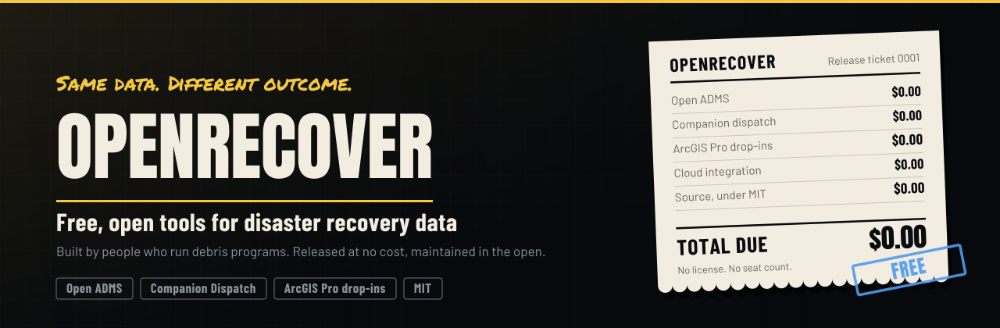

<div align="center">

<picture>
  <source media="(prefers-color-scheme: dark)" srcset="assets/org-banner-dark.svg">
  <source media="(prefers-color-scheme: light)" srcset="assets/org-banner-light.svg">
  
</picture>

[](https://openrecover.com)
[](https://opensource.org/licenses/MIT)
[](https://openrecover.com)

</div>

---

## Whose record is it?

Crews cut the tickets. Monitors took the photos. Residents watched the trucks roll past the curb. The record of all of it lives behind someone else's login, in someone else's format, on someone else's schedule.

Every firm in debris work ended up building software. Not because anyone wanted to be a software company, because an event started and something was needed by Monday. Those tools got built fast, under pressure, by talented operations people working outside their discipline. The version that carries the mission becomes the version you live with for seven years, including the years when a reviewer is asking questions about it.

OpenRecover builds the tools in the open instead, and releases them at no cost.

<br>

## What is here

| Project | What it does | Status |
|---|---|---|
| **[openadms](https://github.com/MrRyanAlexander/openadms)** | An Automated Debris Management System anyone in the industry can run, read and improve. Ticket capture, load calls, truck certifications, site management, the billing engine, and the reporting fields a PAPPG review actually asks for | Public |
| **Companion Dispatch** | A web app for the back office with Android and iOS apps for the field, all on one shared record. Crews, monitors and the client see the same assignment, the same photo, the same timestamp | Coming |
| **ArcGIS Pro drop-ins** | Project templates and field schemas. A working recovery map the same afternoon, with pass and fail geography, imagery and throughput, without custom development | Coming |

Nothing here asks you to rip anything out. These tools connect to Azure, AWS, Google Cloud, CloudFront, or the database a monitoring firm already runs for your project. Keeping the system you have is a valid answer, and the goal is a readable copy of your own data inside it rather than a migration.

<br>

## Start with Open ADMS

```bash
git clone https://github.com/MrRyanAlexander/openadms.git
cd openadms
docker compose up -d db
npm run setup
```

Every deployment is a sovereign instance: your own Postgres, your own keys, your own copy of every ticket, photo, transaction and audit artifact. Nothing phones home. Two instances can share specific records with each other through Ed25519 signed reads, without either one surrendering its database.

**[Read the documentation](https://github.com/MrRyanAlexander/openadms/tree/main/docs)** · **[Architecture](https://github.com/MrRyanAlexander/openadms/blob/main/docs/ARCHITECTURE.md)** · **[The rules engine](https://github.com/MrRyanAlexander/openadms/blob/main/docs/RULES_ENGINE.md)** · **[API](https://github.com/MrRyanAlexander/openadms/blob/main/docs/API.md)**

<br>

## Who tends to use this first

| | |
|---|---|
| **Cities and counties** | The applicant carries the deobligation risk and usually holds the least direct access to the record |
| **Haulers and subcontractors** | Paid on quantities computed by a system they cannot inspect |
| **Monitoring firms and field teams** | Already building spreadsheets around whatever the prime deployed |

<br>

## Contributing

Field experience counts as much as code. A monitor who can describe exactly why a load call gets disputed is contributing something a developer cannot supply. Ticket type proposals, corrections to domain terminology, and reports of what a reviewer actually asked for are all welcome.

See the [contributing guide](https://github.com/MrRyanAlexander/openadms/blob/main/CONTRIBUTING.md).

<br>

## Why free

The tools go out free when they go out. No license, no seat count, no support contract. Release dates go to [the list](https://openrecover.com) first.

Maintained by [Ryan Price](https://github.com/MrRyanAlexander), a debris data manager with seven years of recovery operations across multiple federal declarations, and independent of any prime contractor.

<div align="center">
<br>
<sub><b>Open data. Real recovery.</b></sub>
</div>
