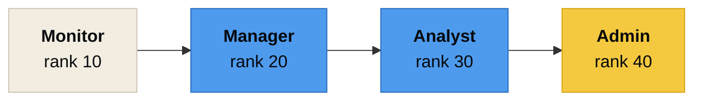
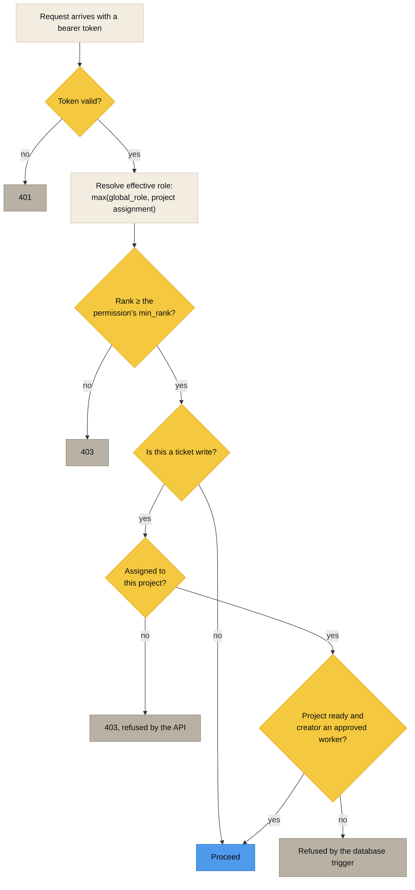

[Docs index](README.md) · [Architecture](ARCHITECTURE.md) · [Data model](DATA_MODEL.md) · [ERD](ERD.md) · [Ticket types](TICKET_TYPES.md) · [Rules](RULES_ENGINE.md) · **Access** · [Federation](FEDERATION.md) · [API](API.md) · [Deploy](DEPLOYMENT.md) · [Testing](TESTING.md) · [Troubleshooting](TROUBLESHOOTING.md)

# Access control

Two questions decide every request. **What rank does this user hold**, and **is this project in their context.**

 

## Roles are cumulative by rank

A role holds every permission at or below its rank. There is no grant table, which means there is no way for two roles to drift apart and no migration needed when a permission is added.

Every permission row carries a `min_rank`. `adms_role_has_permission(role, permission)` is a rank comparison. `role_permission_matrix` is the view the API and the Settings screen read.

| Role | Rank | What it adds over the role beneath it |
|---|---|---|
| **Monitor** | 10 | Create tickets, advance stages, file incidents, read own tickets |
| **Manager** | 20 | Clients, contractors, contracts, equipment, workers, documents, projects, assignments, project ticket types, audit read, reports |
| **Analyst** | 30 | Rules, service codes, rates, disposal sites, project settings, transaction processing, invoices, query builder, sharing flags, ticket void |
| **Admin** | 40 | Ticket type catalog, users and roles, instance and peer settings, transaction reversal, invoice approval |

<b>The full permission list</b>

 

| Permission | Domain | Min rank |
|---|---|---|
| `ticket.create` | tickets | 10 |
| `ticket.read.own` | tickets | 10 |
| `ticket.advance` | tickets | 10 |
| `incident.create` | tickets | 10 |
| `ticket.read.project` | tickets | 20 |
| `ticket.update` | tickets | 20 |
| `ticket.void` | tickets | 30 |
| `client.manage` | org | 20 |
| `contractor.manage` | org | 20 |
| `contract.manage` | org | 20 |
| `equipment.manage` | org | 20 |
| `worker.manage` | org | 20 |
| `document.manage` | org | 20 |
| `project.create` | project | 20 |
| `project.assign` | project | 20 |
| `project.ticket_types` | project | 20 |
| `project.update` | project | 30 |
| `site.manage` | billing | 30 |
| `service_code.manage` | billing | 30 |
| `rate.manage` | billing | 30 |
| `rule.manage` | billing | 30 |
| `transaction.read` | billing | 30 |
| `transaction.process` | billing | 30 |
| `transaction.reverse` | billing | 40 |
| `invoice.manage` | billing | 30 |
| `invoice.approve` | billing | 40 |
| `audit.read` | audit | 20 |
| `report.run` | audit | 20 |
| `query.build` | audit | 30 |
| `sharing.manage` | admin | 30 |
| `ticket_type.manage` | admin | 40 |
| `user.manage` | admin | 40 |
| `instance.manage` | admin | 40 |
| `peer.manage` | admin | 40 |

 

## Rank escalation is bounded

A Manager can create and edit Monitors, because staffing a project is their job. A Manager cannot manufacture an Admin.

| Attempt | Result | Test |
|---|---|---|
| Manager creates a Monitor | Allowed | `test_a_manager_creates_and_edits_a_monitor` |
| Manager grants Admin rank | Refused | `test_a_manager_cannot_grant_admin_rank` |
| Manager promotes an existing Monitor | Refused | `test_a_manager_cannot_promote_an_existing_monitor` |
| Manager edits an account that already holds rank | Refused | `test_a_manager_cannot_edit_an_account_that_already_holds_rank` |
| Manager deactivates an account through an edit | Refused | `test_a_manager_cannot_deactivate_through_an_edit` |
| Manager sets a batch password on an Admin | Refused | `test_a_manager_cannot_batch_a_password_onto_an_admin` |
| Admin does all of the above | Allowed | `test_an_admin_does_both` |
| Monitor reaches the worker list at all | Refused | `test_a_monitor_still_cannot_reach_the_worker_list` |

 

## The active project is always in context

`users.global_role` is the deployment wide floor. A `project_assignments` row can raise it for that project only, so someone who is a Monitor everywhere can be a Manager on the one project they run.

> [!IMPORTANT]
> The last gate is in the database, not the API. A ticket can only be created when the project is fully configured **and** the creator is an approved worker on it, enforced by `trg_tickets_before_insert` reading `project_readiness_summary` and `project_assignments`. A script with a valid `DATABASE_URL` cannot route around it.

`project_readiness` computes nine booleans: client, contract, contractor, disposal site, ticket type, service code, rate, rule, field worker. `project_readiness_summary` adds `ready_for_field`, `ready_for_billing` and a `missing` array, which is what the readiness panel in the back office renders. See the dashboard screenshot in [the repository README](../README.md#what-it-looks-like).

 

## Sessions

| Detail | Value |
|---|---|
| Password hashing | bcrypt, 12 rounds by default (`BCRYPT_ROUNDS`) |
| Access token | JWT, HS256, 60 minutes by default (`ACCESS_TOKEN_MINUTES`) |
| Refresh token | 48 bytes from `secrets.token_urlsafe`, 30 days by default (`REFRESH_TOKEN_DAYS`) |
| Refresh storage | sha256 digest in `user_sessions`. The token itself is never stored |
| Refresh rotation | Single use. Refreshing issues a new pair and invalidates the old one |
| Password change | Revokes every other session for that user |
| Login attempts | Written to the audit trail, successful or not |

`test_refresh_rotates_the_session` asserts the rotation. Reusing a spent refresh token fails.

> [!WARNING]
> `JWT_SECRET` defaults to `change-me-in-production` so a local clone runs without setup. The installer mints a real one. If you deploy by hand, set it, and set it to something from `openssl rand -hex 32`.

 

## The query builder

`POST /api/v1/query/run` lets an Analyst build ad hoc queries against a fixed set of views. It is the one place a user supplies something that looks like SQL, so it gets the strictest handling in the codebase.

| Guard | How |
|---|---|
| Only known sources | `GET /query/sources` lists them. Anything else is refused |
| Column names validated server side | Checked against the live view definition, not against a hardcoded list that can drift |
| Operators validated server side | Same list the rule builder uses |
| Every value is a bound parameter | No string interpolation reaches the driver |
| Every run is audited | Including the exported dataset |

`test_query_builder_rejects_injected_columns` and `test_export_records_itself_in_the_audit_trail` cover both halves.

 

## Audit

Every write leaves an `audit_events` row carrying entity, action, actor, before, after, a computed `changed` diff, the reason, and the request id. The table is append only, enforced by `trg_audit_events_immutable`.

The API sets `adms.actor_id`, `adms.actor_name`, `adms.actor_role`, `adms.reason` and `adms.request_id` as transaction local settings before every write, so attribution does not depend on the application remembering to log anything.

`PATCH` endpoints accept a `_reason` field, which is written into the artifact. Reversals require one.

 

**[Docs index](README.md)** · **[Federation](FEDERATION.md)** · **[Repository](../README.md)**

