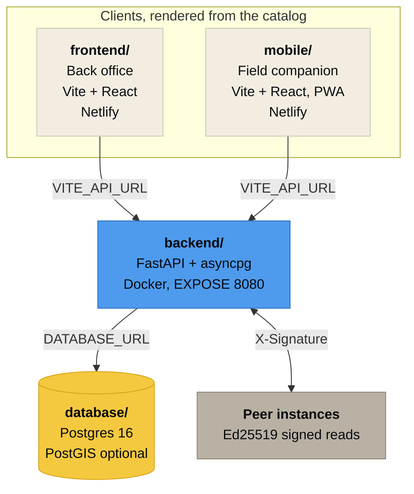
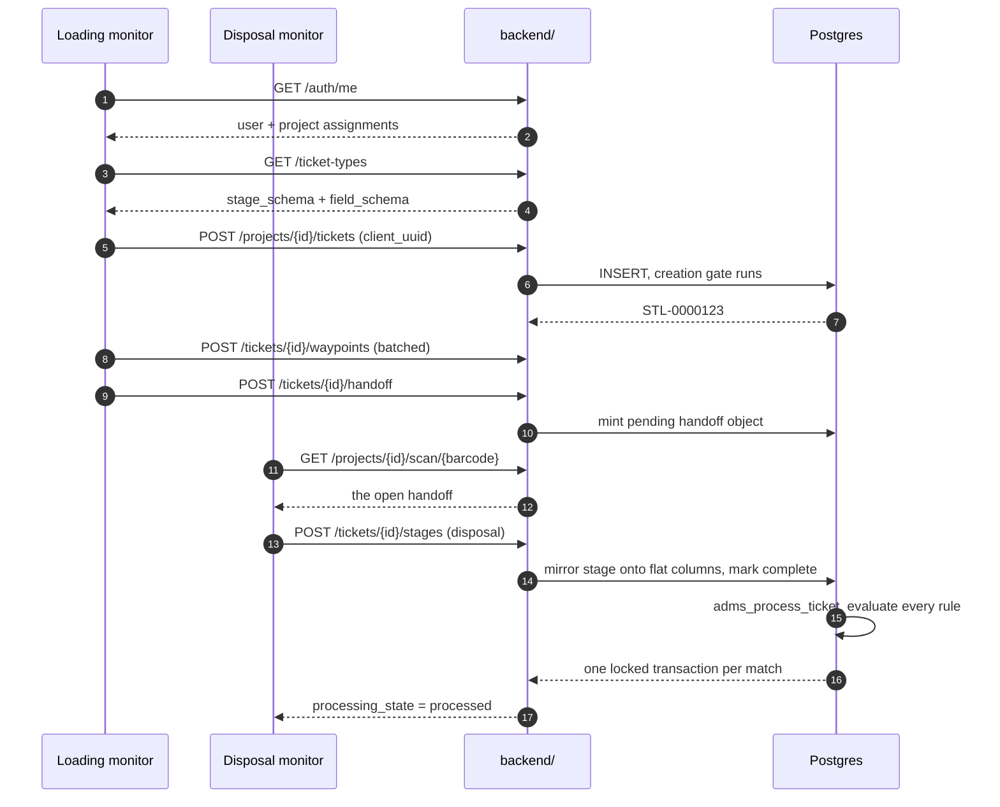

**[Docs index](README.md)** · [Data model](DATA_MODEL.md) · [ERD](ERD.md) · [Ticket types](TICKET_TYPES.md) · [Rules](RULES_ENGINE.md) · [Access](ACCESS_CONTROL.md) · [Federation](FEDERATION.md) · [API](API.md) · [Deploy](DEPLOYMENT.md) · [Testing](TESTING.md) · [Troubleshooting](TROUBLESHOOTING.md)

# Architecture

Four deployable parts, one contract between them.

Each part takes exactly one variable from the part below it. The API takes `DATABASE_URL`. Both frontends take `VITE_API_URL`. There is no service discovery layer, no message broker and no cache tier to keep coherent.

 

## Why the logic lives in the database

Debris monitoring data is read years later by someone looking for a reason to deobligate. The properties that matter under that reading, an audit artifact for every change, transactions that cannot be edited, a ticket that cannot exist on an unconfigured project, are worth nothing if an application bug or a direct `psql` session can bypass them. So they are enforced where nothing can.

| Property | Enforced by |
|---|---|
| Transactions never change | `BEFORE UPDATE OR DELETE` trigger raising `restrict_violation` |
| Audit history never changes | The same trigger on `audit_events` |
| Every write is audited | `AFTER INSERT/UPDATE/DELETE` row trigger on 24 tables |
| Tickets need a ready project | `BEFORE INSERT` trigger reading `project_readiness_summary` |
| Tickets need an approved creator | The same trigger against `project_assignments` |
| Rules need a project scoped code and contract | `BEFORE INSERT OR UPDATE` trigger on `rules` |
| Service codes need a project contractor | `BEFORE INSERT OR UPDATE` trigger on `service_codes` |
| Hidden ticket types stay hidden | `BEFORE INSERT` trigger on `project_ticket_types` |
| Estimates are append only | `BEFORE UPDATE OR DELETE` trigger on `project_estimates` |
| A permit cannot be verified without a document | `BEFORE UPDATE` trigger on `project_sites` |
| One transaction per ticket per rule | Partial unique index |
| One transaction per invoice | Unique index on `invoice_lines.transaction_id` |

> [!TIP]
> The API sets `adms.actor_id`, `adms.actor_name`, `adms.actor_role`, `adms.reason` and `adms.request_id` as transaction local settings before every write, so the audit trigger can attribute the change without the application having to remember to log it. A write that forgets to set them still gets audited, just without a name attached.

 

## Portability

PostGIS is **optional**. Every coordinate is stored as plain `numeric` latitude and longitude, and distance falls back to `adms_distance_miles`, a great circle function written in SQL. Migration [`0013_postgis_optional.sql`](../database/migrations/0013_postgis_optional.sql) detects PostGIS and, where present, layers generated `geography` columns and GiST indexes on top.

The same schema runs unchanged on Railway, Neon, Supabase, RDS and Cloud SQL.

<b>The small compatibility details that make that true</b>

 

| Detail | Why it exists |
|---|---|
| `DATABASE_URL` is normalised in [`config.py`](../backend/app/config.py) | Hosts hand out `postgres://`, `postgresql://` and `postgresql+asyncpg://`. All three are accepted |
| CORS is configured by **regex**, not by list | Netlify deploy previews get a generated hostname on every build |
| `Content-Disposition` is in `expose_headers` | Otherwise a download arrives named `download` whatever the server called it |
| Every migration records its `sha256` | `./database/migrate.sh --verify` fails if an applied file changed on disk |
| The API image is a plain `Dockerfile` with `EXPOSE 8080` | App Runner, Cloud Run and Railway all accept it without modification |

 

## The catalog is the contract between server and clients

Neither client hard codes a ticket type. Both fetch `ticket_types.stage_schema` and `ticket_types.field_schema` and render from them.

- The **field app** walks the stages in order, showing only the fields declared for the current stage, choosing an input per `type`. A `percent` becomes load call buttons plus a slider, `photo` opens the camera, `barcode` offers a scan, `gps` is captured automatically.
- The **back office** renders the same schema as a read only lifecycle timeline, and edits it in the Ticket Catalog screen.

A field the type invents that has no column lands in `tickets.data`, which is JSONB and GIN indexed, and is still queryable, reportable and rule addressable.

Full reference: [Ticket types](TICKET_TYPES.md).

 

## Request flow, a load ticket

Every write in that sequence left an audit artifact.

 

## Offline

The field app treats loss of signal as normal rather than as an error state.

| Behavior | How |
|---|---|
| No duplicate tickets on replay | Each ticket is minted with a `client_uuid` before it leaves the phone. The server returns the ticket it already stored rather than creating a second one |
| Writes survive a dead zone | Anything that cannot reach the server is held in `localStorage` and flushed automatically when connectivity returns |
| Drafts survive a locked phone | Stage input is persisted as it is typed, not on submit |
| The queue cannot wedge | A 4xx response is treated as a permanent rejection and dropped. A 5xx or a network failure is retried |

> [!NOTE]
> Idempotency is the property that makes the rest of it safe. Without `client_uuid`, a monitor in a dead zone who retries three times creates three tickets and three transactions, and someone spends a week reconciling them at closeout.

 

## Where to read next

| You want to | Go to |
|---|---|
| Understand the tables | [Data model](DATA_MODEL.md) and [ERD](ERD.md) |
| Add a ticket type | [Ticket types](TICKET_TYPES.md) |
| Understand billing | [The rules engine](RULES_ENGINE.md) |
| Call the API | [API reference](API.md) |
| Run two instances against each other | [Federation](FEDERATION.md) |

**[Docs index](README.md)** · **[Repository](../README.md)**

