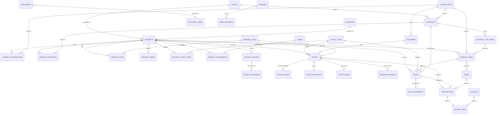
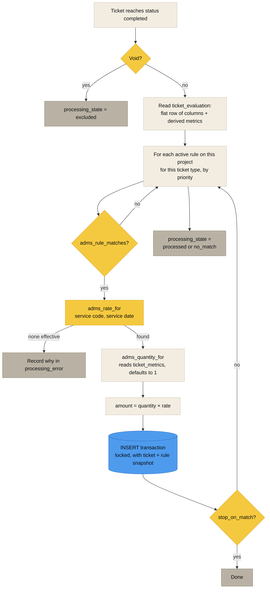
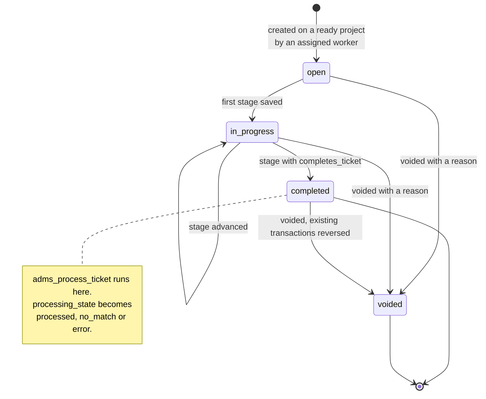

[Docs index](README.md) · [Architecture](ARCHITECTURE.md) · [Data model](DATA_MODEL.md) · **ERD** · [Ticket types](TICKET_TYPES.md) · [Rules](RULES_ENGINE.md) · [Access](ACCESS_CONTROL.md) · [Federation](FEDERATION.md) · [API](API.md) · [Deploy](DEPLOYMENT.md) · [Testing](TESTING.md) · [Troubleshooting](TROUBLESHOOTING.md)

# Entity relationships

The spine, minus the lookup tables. Column level detail lives in [the data model](DATA_MODEL.md).

> [!NOTE]
> `DOCUMENTS`, `CONTACTS` and `AUDIT_EVENTS` attach to any parent through `entity_type` plus `entity_id` rather than a foreign key per parent kind, so they do not appear as edges above. They hang off nearly everything.

 

## The evaluation path

What happens the moment a ticket reaches `completed`.

Re-running this over an already processed ticket is safe. A partial unique index on ticket plus rule means the second pass writes nothing.

 

## Quantity sources

The unit type on the rate names the column on `ticket_metrics` that the engine reads. Nothing here is typed by a human.

| Unit type | Reads | Derived from |
|---|---|---|
| `per_cubic_yard` | `billable_cubic_yards` | certified capacity × load call % |
| `per_ton` | `net_tons` | net weight, else gross − tare, ÷ 2000 |
| `per_mile` | `haul_miles` | odometer, else waypoint path, else straight line |
| `per_labor_hour` | `labor_hours` | recorded on the ticket |
| `per_equip_hour` | `equipment_hours` | recorded on the ticket |
| `per_unit` | `unit_count` | `tickets.quantity`, else 1 |
| `per_each` / `flat` | `each` / `flat` | always 1 |
| `per_diameter_in` | `stump_diameter_inches` | `tickets.data` |
| `per_linear_foot` | `linear_feet` | `tickets.data` |

Adding a tenth unit type is a row in `unit_types` plus a column on `ticket_metrics`. See [The rules engine](RULES_ENGINE.md).

 

## Ticket lifecycle states

 

**[Docs index](README.md)** · **[Data model](DATA_MODEL.md)** · **[Repository](../README.md)**

