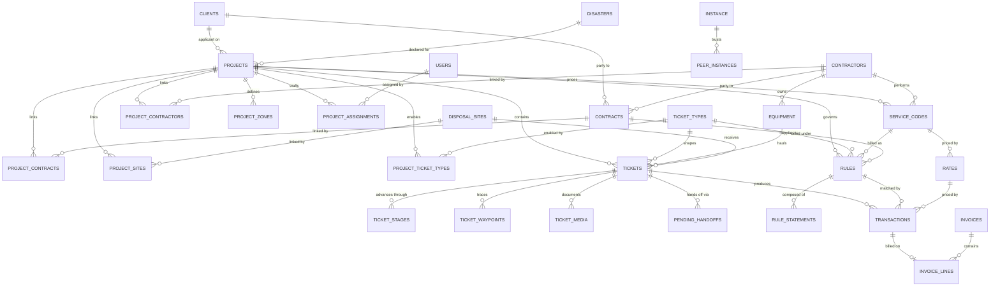
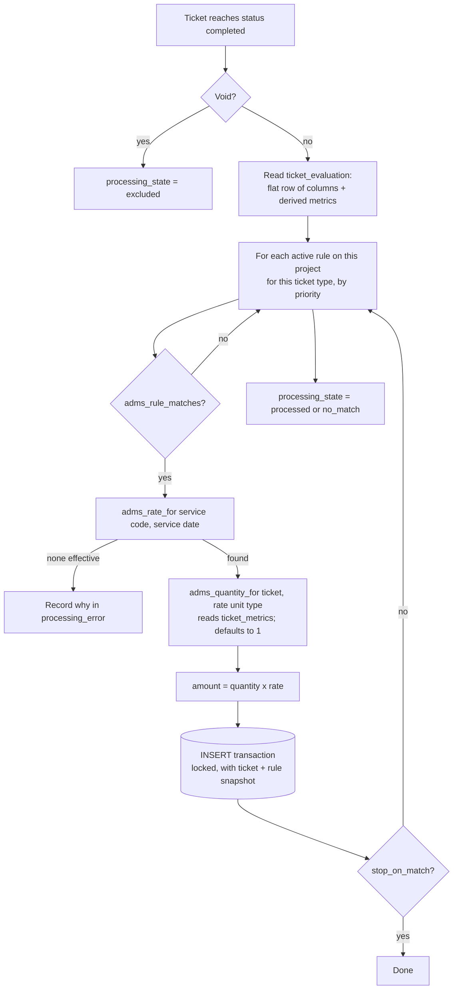

# Entity relationships

The spine, minus the lookup tables.

## The evaluation path

## Quantity sources

| Unit type | Reads | Derived from |
|---|---|---|
| `per_cubic_yard` | `billable_cubic_yards` | certified capacity × load call % |
| `per_ton` | `net_tons` | net weight, else gross − tare, ÷ 2000 |
| `per_mile` | `haul_miles` | odometer, else waypoint path, else straight line |
| `per_labor_hour` | `labor_hours` | recorded on the ticket |
| `per_equip_hour` | `equipment_hours` | recorded on the ticket |
| `per_unit` | `unit_count` | `tickets.quantity`, else 1 |
| `per_each` / `flat_fee` | `each` / `flat` | always 1 |
| `per_diameter_in` | `stump_diameter_inches` | `tickets.data` |
| `per_linear_foot` | `linear_feet` | `tickets.data` |
