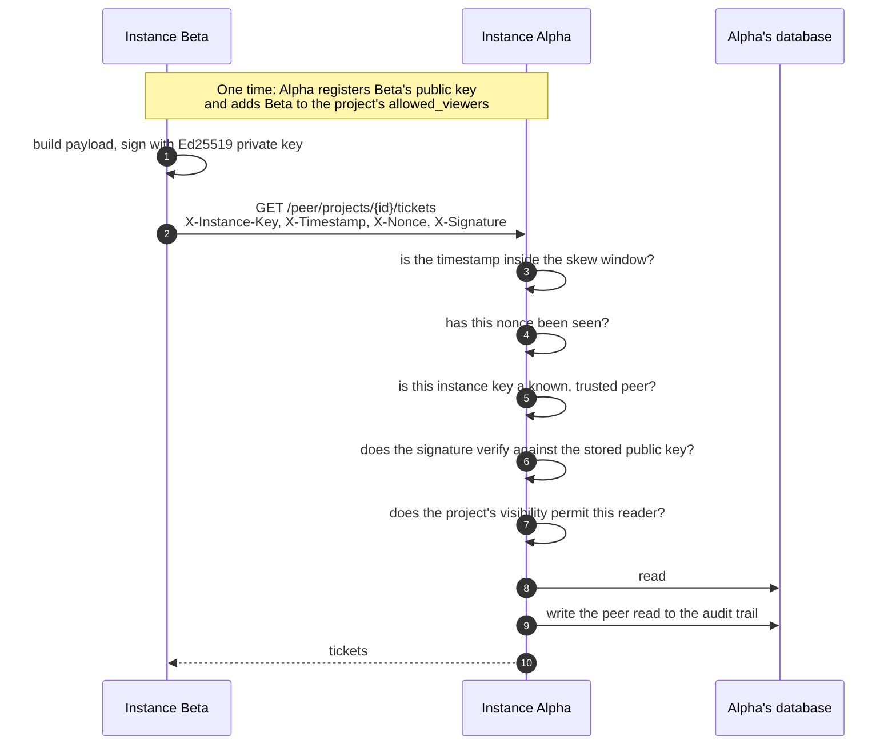

<div align="center">
<sub>

[Docs index](README.md) · [Architecture](ARCHITECTURE.md) · [Data model](DATA_MODEL.md) · [ERD](ERD.md) · [Ticket types](TICKET_TYPES.md) · [Rules](RULES_ENGINE.md) · [Access](ACCESS_CONTROL.md) · **Federation** · [API](API.md) · [Deploy](DEPLOYMENT.md) · [Testing](TESTING.md) · [Troubleshooting](TROUBLESHOOTING.md)

</sub>
</div>

# Federation

Every deployment is a sovereign instance. Federation is how two of them share specific records without either one surrendering its database.

The situation it exists for is ordinary. A county runs its own instance. Its monitoring firm runs another. The prime contractor runs a third. All three need to see the same load tickets, and none of them should have to log into somebody else's system to get their own record.

<br>

## Identity

Each instance holds exactly one row in `instance`, enforced by a partial unique index.

| Field | What it is |
|---|---|
| `instance_key` | 64 hex characters, minted with `crypto.randomBytes(32).toString('hex')` at install |
| Ed25519 private key | Signs outbound peer reads. Written `chmod 600` by the installer |
| Ed25519 public key | Published at `GET /api/v1/peer/identity`, unauthenticated |
| `display_name` | What a peer sees when it registers you |

`POST /api/v1/instance/rotate-keys` issues a new pair. Peers have to be given the new public key, which is the intended friction.

<br>

## Visibility

Projects and tickets each carry a flag.

| Flag | Who can read it |
|---|---|
| `private` | Authenticated users of this instance only. The default |
| `restricted` | Peers listed in `allowed_viewers`, presenting a valid `X-Signature` |
| `public` | Any caller, no signature |

Setting a flag requires the `sharing.manage` permission, which is rank 30. `PUT /projects/{id}/share` and `PUT /tickets/{id}/share` are the endpoints.

<br>

## The signed read



### Building the signature

```
payload = METHOD + "\n" + path + "\n" + instance_key + "\n"
        + timestamp + "\n" + nonce + "\n" + sha256(body)

X-Instance-Key: <64 hex>
X-Timestamp:    <ISO 8601>
X-Nonce:        <single use>
X-Signature:    base64(ed25519_sign(payload))
```

The body hash is included even on a `GET`, where it is the sha256 of the empty string. That keeps one signing routine rather than two.

### What gets refused

| Condition | Response |
|---|---|
| No signature on a `private` or `restricted` project | 403 |
| Timestamp outside `PEER_SIGNATURE_SKEW_SECONDS` (default 300) | 403 |
| Nonce already seen | 403 |
| Instance key not in `peer_instances` | 403 |
| Peer registered but not trusted | 403 |
| Signature does not verify | 403 |
| Peer valid, but not in this project's `allowed_viewers` | 403 |

Nonces are stored in `peer_request_nonces` and are single use. Replaying a captured request fails even inside the skew window.

> [!NOTE]
> Every peer read is written to the audit trail, including the ones that succeed. An instance owner can answer "who read this project, and when" without instrumenting anything.

<br>

## Setting it up

<details open>
<summary><b>Alpha grants Beta read access to one project</b></summary>
<br>

**On Beta**, get the identity:

```bash
curl https://beta.example.org/api/v1/peer/identity
# { "instance_key": "a3f2...", "public_key": "MCowBQYDK2VwAyEA...", "display_name": "Beta County" }
```

**On Alpha**, register Beta as a peer (admin, `peer.manage`):

```bash
curl -X POST https://alpha.example.org/api/v1/peers \
  -H "Authorization: Bearer $ALPHA_TOKEN" \
  -H "Content-Type: application/json" \
  -d '{"instance_key":"a3f2...","public_key":"MCowBQYDK2VwAyEA...",
       "display_name":"Beta County","is_trusted":true}'
```

**On Alpha**, restrict the project to Beta:

```bash
curl -X PUT https://alpha.example.org/api/v1/projects/$PROJECT_ID/share \
  -H "Authorization: Bearer $ALPHA_TOKEN" \
  -H "Content-Type: application/json" \
  -d '{"visibility":"restricted","allowed_viewers":["a3f2..."]}'
```

**From Beta**, read it. The signing is handled by [`backend/app/federation.py`](../backend/app/federation.py) if you are calling from another Open ADMS instance.

</details>

<details>
<summary><b>Signing a request from your own code</b></summary>
<br>

```python
import base64, hashlib, secrets
from datetime import datetime, timezone
from cryptography.hazmat.primitives.asymmetric.ed25519 import Ed25519PrivateKey

def sign(private_key: Ed25519PrivateKey, method: str, path: str,
         instance_key: str, body: bytes = b"") -> dict[str, str]:
    timestamp = datetime.now(timezone.utc).isoformat()
    nonce = secrets.token_urlsafe(16)
    body_sha = hashlib.sha256(body).hexdigest()
    payload = "\n".join([method, path, instance_key, timestamp, nonce, body_sha])
    signature = private_key.sign(payload.encode())
    return {
        "X-Instance-Key": instance_key,
        "X-Timestamp": timestamp,
        "X-Nonce": nonce,
        "X-Signature": base64.b64encode(signature).decode(),
    }
```

</details>

<br>

## Proving it works

Federation is verified against two live instances, not mocked.

```bash
# Instance Alpha and Instance Beta, each with its own DATABASE_URL
./database/setup.sh --with-demo
cd backend && python3 -m pytest -k peer
```

`test_a_restricted_project_needs_a_valid_signature` registers Beta on Alpha, restricts a project to Beta's key, then asserts:

- Beta reads it successfully with a valid signature
- A replayed nonce is refused
- A forged signature is refused
- An unregistered third party receives 403
- An unsigned request receives 403

Alongside it, `test_a_private_project_refuses_an_unsigned_peer_read`, `test_a_public_project_serves_an_unsigned_peer_read` and `test_a_peer_read_is_written_to_the_audit_trail` cover the other three corners.

<br>

## The trust model, stated plainly

| Open ADMS does | Open ADMS does not |
|---|---|
| Let you publish specific records to specific instances | Push your data anywhere by default |
| Verify who is asking, cryptographically | Rely on a shared secret or an API key that leaks |
| Record every peer read in your audit trail | Let a peer read anything you did not flag |
| Let you revoke a peer, or rotate your keys, at any time | Require a central registry to work |

`REGISTRY_URL` is optional. It exists so an instance can advertise its public identity for discovery, and an instance that never sets it federates fine as long as the two operators exchange keys directly.

<br>

<div align="center">
<sub>

**[Docs index](README.md)** · **[Access control](ACCESS_CONTROL.md)** · **[Repository](../README.md)**

</sub>
</div>
