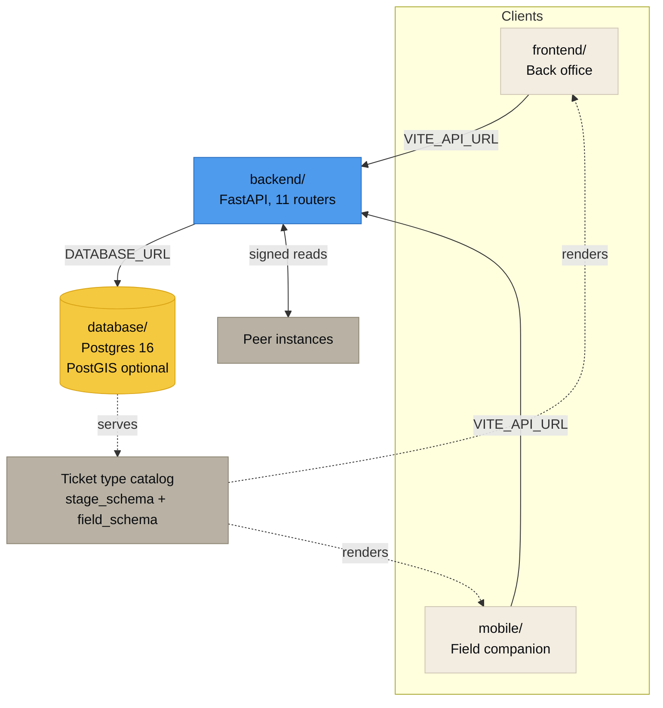

<picture>
  <source media="(prefers-color-scheme: dark)" srcset="assets/banner-dark.svg">
  <source media="(prefers-color-scheme: light)" srcset="assets/banner-light.svg">
  
</picture>

# Documentation

**[← Back to the repository](../README.md)**

---

Twelve pages, grouped by what you are trying to do. Every page is written to be read on its own, so there is some deliberate repetition between them.

 

## Start here

| | Page | Read it when |
|---|---|---|
| 🧭 | [**Architecture**](ARCHITECTURE.md) | You want to know how the four parts fit together and why so much logic sits in the database |
| 🗄️ | [**Data model**](DATA_MODEL.md) | You are about to write a query, a migration, or a report |
| 🔗 | [**Entity relationships**](ERD.md) | You want the spine as a picture, plus the evaluation path a completed ticket walks |

## The domain

| | Page | Read it when |
|---|---|---|
| 🎫 | [**Ticket types**](TICKET_TYPES.md) | A contract needs a form the catalog does not have yet |
| ⚖️ | [**The rules engine**](RULES_ENGINE.md) | You are configuring billing, or a ticket did not produce the transaction you expected |
| 🔐 | [**Access control**](ACCESS_CONTROL.md) | You are deciding who gets which role, or an endpoint returned 403 |
| 🛰️ | [**Federation**](FEDERATION.md) | Two organizations need to read each other's records without merging databases |

## Building and running

| | Page | Read it when |
|---|---|---|
| 🔌 | [**API reference**](API.md) | You are writing a client, a script, or an integration |
| 🚀 | [**Deployment**](DEPLOYMENT.md) | You are putting an instance somewhere real |
| 🧪 | [**Testing**](TESTING.md) | You are adding a feature, or you want to know what is already guaranteed |
| 🩺 | [**Troubleshooting**](TROUBLESHOOTING.md) | Something is broken and you want the answer, not a debugging session |

## The definition of correct

| | Page | Read it when |
|---|---|---|
| 📐 | [**Product specification**](spec/) | You need the numbered, testable requirements that the running system is measured against |

## Working notes

Design records rather than reference pages. Kept because the reasoning behind a decision is worth more than the decision by itself.

<b>Open the working notes</b>

 

| Page | What it records |
|---|---|
| [Legacy rule editor analysis](RULES_AND_TRANSACTIONS.md) | A screen by screen study of the incumbent rule editor, the control to schema map, where the money actually comes from, and the known gaps |
| [Back office remediation plan](BACKOFFICE_REMEDIATION_PLAN.md) | The phased plan behind the current back office, with decisions on record and what was built |

 

---

## How the pieces relate

The arrow worth noticing is the dotted one. Neither client hard codes a ticket type. Both fetch the catalog and render from it, which is the reason a new ticket type is an `INSERT` rather than a release.

 

## Conventions used across these pages

| Convention | Meaning |
|---|---|
| `code_font` in prose | A real identifier: a table, column, function, environment variable or endpoint you can search the repository for |
| **Enforced by trigger** | The database refuses the write. An application bug, a script, or a direct `psql` session cannot route around it |
| **Enforced by the API** | The application refuses the request. Useful, and not the last line of defense |
| Migration numbers | `0008_billing_rules.sql` and friends live in [`database/migrations/`](../database/migrations) and run in order, one transaction per file |

 

---

**[Repository](../README.md)** · **[Contributing](../CONTRIBUTING.md)** · **[Security](../SECURITY.md)** · **[License](../LICENSE)** · **[OpenRecover](https://openrecover.com)**

