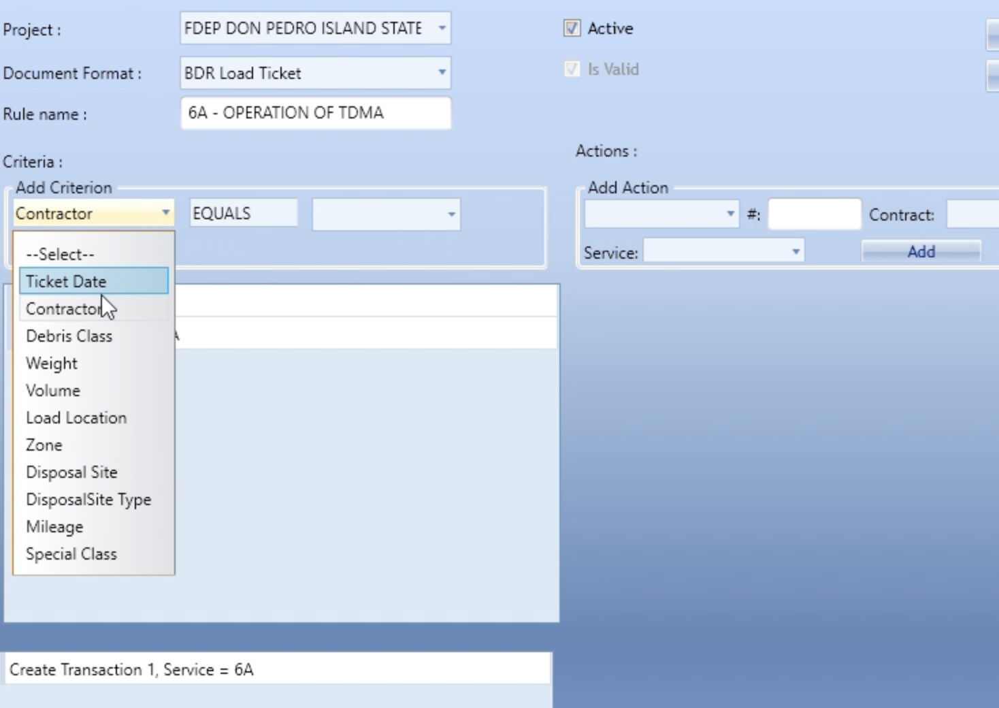
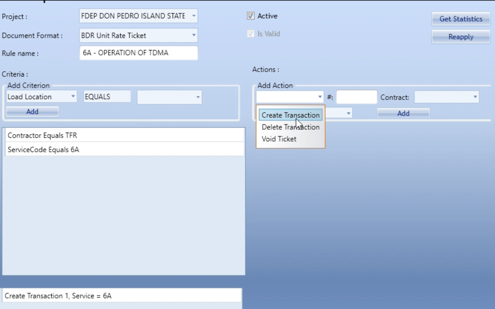
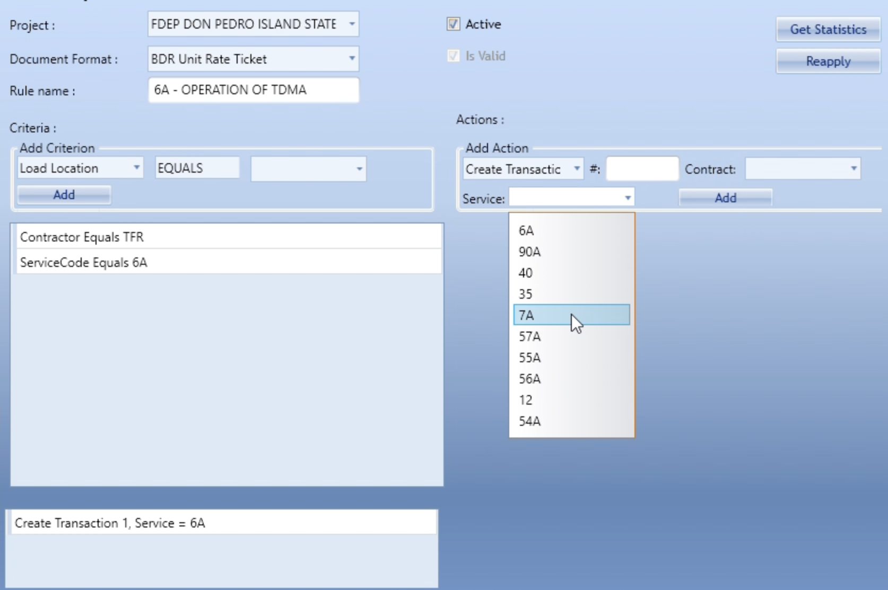

# Rules and transactions: how a rule creates money

Reference note. Source material is a set of ten screenshots of the legacy
platform's project rule editor, captured from the FDEP DON PEDRO ISLAND STATE
project. Everything in "What the legacy editor does" is observed directly from
those screenshots. Everything in "How Open ADMS models it" is our schema as it
stands in `database/migrations/0008_billing_rules.sql` and
`0011_evaluation_engine.sql`. The gaps section is where the two disagree, and
those are the decisions we still owe ourselves.

Screenshots live in `docs/images/legacy-rule-editor/`.

---

## 1. The one sentence that matters

A rule is a filter plus an instruction. The filter is a list of criteria
evaluated against one ticket. The instruction is an **action**, and the action
is where the service code lives. The criteria decide *whether* a ticket bills.
The action decides *what it bills as*.

```
Rule ("6A - OPERATION OF TDMA")
  bound to  ->  Project  +  Document Format (ticket type)
  Criteria  ->  Contractor EQUALS TFR
                ServiceCode EQUALS 6A
  Action    ->  Create Transaction #1
                  Contract = FDEP - TFR - HURRICANE ...
                  Service  = 6A          <- the billing link
```

The service code is not derived from the criteria and it is not derived from
the ticket. It is named explicitly on the action. That is the link. A rule with
criteria and no action evaluates and produces nothing.

---

## 2. What the legacy editor does

### 2.1 Screen anatomy

| Control | Position | Behavior observed |
|---|---|---|
| Project | header | Scopes everything below it. All value pickers resolve inside this project. |
| Document Format | header | The ticket type the rule binds to: `BDR Load Ticket`, `BDR Haul-out Ticket`, `BDR Unit Rate Ticket`. **Changing it changes the operand list.** |
| Rule name | header | Free text. Convention in the sample: service code first, then the work. `6A - OPERATION OF TDMA`. |
| Active | header, checkbox | Editable. Rule participates in evaluation. |
| Is Valid | header, checkbox | Greyed out in every screenshot. Derived, not set by the user. The system decides whether the rule is well formed. |
| Get Statistics | header, button | Not exercised in the captures. Reads as a match-count / impact preview for the rule. |
| Reapply | header, button | Re-runs the rule set over existing tickets. This is the "I fixed the rule, now fix the tickets" control. |
| Add Criterion | left pane | Three fields: operand, operator, value. Then `Add`. |
| Criteria list | left pane | Saved criteria as readable sentences: `Contractor Equals TFR`, `ServiceCode Equals 6A`. |
| Add Action | right pane | Action type, `#`, `Contract`, `Service`. Then `Add`. |
| Actions list | bottom | `Create Transaction 1, Service = 6A`. Selecting a row loads it back into the Add Action panel and the button flips from `Add` to `Update` / `Delete` (screenshot 10). |

### 2.2 The operand list is scoped to the document format

This is the most important structural finding in the screenshots. The left
dropdown does not offer one universal field list. Each document format offers
only the fields that format actually records.

| Operand | BDR Load Ticket | BDR Haul-out Ticket | BDR Unit Rate Ticket |
|---|:--:|:--:|:--:|
| Ticket Date | yes | yes | yes |
| Contractor | yes | yes | yes |
| Debris Class | yes | yes | no |
| Weight | yes | yes | no |
| Volume | yes | yes | no |
| Load Location | yes | yes | yes |
| Zone | yes | **no** | yes |
| Disposal Site | yes | yes | no |
| DisposalSite Type | yes | yes | no |
| Mileage | yes | yes | no |
| Special Class | yes | **no** | yes |
| Service Code | no | no | **yes** |
| Unit Count | no | no | yes |
| Measurement | no | no | yes |



Screenshots 1, 4 and 5. The three lists are genuinely different, not a
superset with disabled entries. A haul-out rule cannot reference Zone. A unit
rate rule cannot reference Weight, Volume, Disposal Site or Mileage.

Note the asymmetry on the Unit Rate format: `Service Code` is an operand there.
On a unit rate ticket the field crew records which service they performed, so
the rule filters on it. On a load ticket the service is inferred entirely from
the rule, because the crew never records one.

### 2.3 Operators

Only three appear, on the `Ticket Date` operand (screenshot 2):

`EQUALS`, `NOTEQUALS`, `BETWEEN`

`BETWEEN` on a date operand is how the legacy system does effective dating.
There is no start/end date field on the rule header. A rule that should only
apply to a date window carries `Ticket Date BETWEEN x and y` as a criterion.

### 2.4 The value control changes shape by operand type

| Operand type | Control | Evidence |
|---|---|---|
| Date | Text box plus calendar picker button | Screenshot 2 |
| Enumerated, project scoped | Dropdown populated from project config | Screenshots 3, 6 |
| Free text / numeric | Plain text box | Inferred, not captured |

The Disposal Site picker on this project offers exactly one value,
`CHARLOTTE COUNTY LANDFILL` (screenshot 3). The Service Code picker offers
`6A, 90A, 40, 35, 7A, 57A, 55A, 56A, 12, 54A` (screenshot 6). Both lists are
project configuration, not global. The rule builder never lets you type a value
the project has not been set up to produce, which is why an invalid rule is
mostly impossible to author by hand.

### 2.5 Actions

Three action types (screenshot 7):




| Action | Meaning |
|---|---|
| **Create Transaction** | Write a billable line. Requires `#`, `Contract` and `Service`. |
| **Delete Transaction** | Remove a line the rule set previously created. |
| **Void Ticket** | Mark the ticket itself unusable. No contract or service needed. |

The `#` field is the transaction ordinal within the rule, set to `1` in the
sample (screenshot 10, action row reads `Create Transaction 1, Service = 6A`).
Its existence means **one rule can emit more than one transaction**. That is how
a single event bills two ways: for example one match producing a haul line and
a separate disposal or mobilization line, each with its own service code, under
the same criteria.

The `Contract` picker offers two kinds of value (screenshot 8):

| Value | Reading |
|---|---|
| `FDEP - TFR - HURRICAN...` | A specific contract on the project. The transaction is pinned to it. |
| `Ticket Contract` | A symbolic binding: use whatever contract the ticket itself carries. |

`Ticket Contract` is an inference from the label, not something the screenshots
prove, but it is the only sensible reading of a non-contract entry sitting in a
contract list. It matters: it is the difference between a rule that has to be
duplicated per contract and one rule that serves all of them.



The `Service` picker on the action (screenshot 9) offers the same project
service code list as the Service Code *criterion* on unit rate tickets. Same
list, entirely different job. Criterion: "did the crew record 6A". Action:
"bill this as 6A". Do not conflate them in our UI.

### 2.6 One editor caution worth recording

In the captures, the criteria list still reads `Contractor Equals TFR` /
`ServiceCode Equals 6A` while the Document Format is switched between Load
Ticket, Haul-out and Unit Rate. `ServiceCode` is not a legal operand on the
Load Ticket or Haul-out formats. This is either a stale rule loaded in the
editor while the format selector was being demonstrated, or the editor does not
re-validate criteria when the format changes. Either way the lesson stands:

**A rule belongs to exactly one document format, and every criterion on it must
be revalidated against that format's operand list.** That is almost certainly
what the greyed `Is Valid` box reports.

---

## 3. How Open ADMS models it

### 3.1 Control to schema map

| Legacy control | Open ADMS |
|---|---|
| Project | `rules.project_id` |
| Document Format | `rules.ticket_type_id`, gated by `project_ticket_types` |
| Rule name | `rules.name`, unique per project |
| Active | `rules.is_active` |
| Is Valid | `trg_rules_scope` on insert/update, plus `project_readiness_summary` |
| Reapply | `adms_process_ticket(ticket, actor)`, idempotent by `ON CONFLICT (ticket_id, rule_id)` |
| Get Statistics | **no equivalent yet** |
| Criterion operand | `rule_statements.operand_code` into `rule_operands` |
| Criterion operator | `rule_statements.operator_code` into `rule_operators` |
| Criterion value | `rule_statements.value` jsonb, plus `value_label` for the readable sentence |
| Criteria list sentence | `operand.label` + `operator.label` + `value_label` |
| Value picker source | `rule_operands.options_source` names the project scoped list |
| Action: Create Transaction | implicit. Every rule match writes one transaction. |
| Action: Delete Transaction | `adms_reverse_transaction(txn, reason, actor)`. Transactions are append only, so a delete is a negating row. |
| Action: Void Ticket | `tickets.is_void`. Not currently reachable from a rule. |
| Action `#` | **no equivalent yet** |
| Action Contract | `rules.contract_id`, NOT NULL, gated by `project_contracts` |
| Action Service | `rules.service_code_id`, NOT NULL, gated to the same project |
| (not in legacy UI) | `rules.match_mode` all / any, `rules.priority`, `rules.stop_on_match`, `rules.effective_from` / `effective_to`, `rules.quantity_override` |

### 3.2 Operand coverage

Every legacy operand has a home:

| Legacy | Open ADMS operand | `source_path` on `ticket_evaluation` |
|---|---|---|
| Ticket Date | `service_date` | `service_date` |
| Contractor | `contractor` | `contractor_id` |
| Debris Class | `debris_type` | `debris_type` |
| Weight | `tons` | `net_tons` |
| Volume | `cubic_yards` | `billable_cubic_yards` |
| Load Location | `origin_site` | `origin_site_id` |
| Zone | `zone` | `zone_code` |
| Disposal Site | `destination_site` | `destination_site_id` |
| DisposalSite Type | `site_kind` | `destination_site_kind` |
| Mileage | `distance` | `haul_miles` |
| Special Class | `special_class` | `special_class` |
| Unit Count | `unit_count` | `unit_count` |
| Service Code | **missing** | see 4.5 |
| Measurement | **missing (partially)** | `stump_diameter_inches`, `linear_feet` |

Our operator set is a superset of the legacy three. `EQUALS` / `NOTEQUALS` /
`BETWEEN` map to `eq` / `ne` / `between`; we add `gt gte lt lte in not_in
contains starts_with is_null is_not_null`.

### 3.3 Where the money actually comes from

The legacy action names the service code. It does not name a price. Ours works
the same way and the chain is worth stating once, in full:

```
rule matches ticket
  -> rules.service_code_id
  -> adms_rate_for(service_code, service_date)   picks the rate effective that day
  -> rate.unit_type                              e.g. per_cubic_yard
  -> unit_types.quantity_source                  e.g. billable_cubic_yards
  -> ticket_metrics.<that column>                the derived quantity
  -> quantity clamped by rate min / max, or replaced by rules.quantity_override
  -> amount = quantity * rate.amount
  -> INSERT transactions (+ ticket snapshot, + rule snapshot)
```

No human types a quantity and no human types an amount. The rule chooses the
code, the code and the date choose the rate, the rate's unit chooses which
derived metric to read, and the ticket supplies the number. A matched rule with
no effective rate on the service date does not silently drop: the ticket goes
to `processing_state = 'error'` with the rule named in `processing_error`.

Both `snapshot` (the evaluated ticket row) and `rule_snapshot` (the rule name,
match mode, priority and every statement with its `value_label`) are frozen
onto the transaction. Three years later an auditor can read why the line exists
without the rule still being in the same shape.

---

## 4. Gaps, and what to do about them

### 4.1 One rule, many transactions. We cannot do this yet.

The legacy `#` ordinal proves a rule can emit `Create Transaction 1` and
`Create Transaction 2` with different service codes under one set of criteria.
Our schema blocks it in two places:

- `rules.service_code_id` and `rules.contract_id` are singular columns on the rule
- `CREATE UNIQUE INDEX transactions_one_per_ticket_rule ON transactions (ticket_id, rule_id) WHERE NOT is_reversal`

Today the workaround is to author N rules with identical criteria. That is
duplicated logic that drifts, which is exactly the failure a rules engine is
supposed to prevent.

Fix, when we take it: a `rule_actions` child table.

```sql
CREATE TABLE rule_actions (
    id               uuid PRIMARY KEY DEFAULT gen_random_uuid(),
    rule_id          uuid NOT NULL REFERENCES rules (id) ON DELETE CASCADE,
    sequence         integer NOT NULL DEFAULT 1,       -- the legacy "#"
    action_type      text NOT NULL DEFAULT 'create_transaction',
    service_code_id  uuid REFERENCES service_codes (id),
    contract_id      uuid REFERENCES contracts (id),   -- NULL means "ticket contract"
    quantity_override numeric(14,4),
    UNIQUE (rule_id, sequence),
    CONSTRAINT rule_actions_shape CHECK (
        action_type <> 'create_transaction'
        OR service_code_id IS NOT NULL)
);
```

and widen the transaction guard to
`UNIQUE (ticket_id, rule_id, rule_action_sequence) WHERE NOT is_reversal`.

### 4.2 Action types beyond "create"

`Void Ticket` as a rule action is a real capability we do not have. A rule that
recognizes an unbillable condition and voids the ticket is a strong QC control
(no photo, load call over 100 percent, disposal site not on the contract). Our
engine currently only excludes void tickets, it never creates the void.

`Delete Transaction` maps onto `adms_reverse_transaction`, not onto a delete.
Keep our semantics, keep their label out of our UI. Call it **Reverse**.

### 4.3 "Ticket Contract" as a dynamic binding

Our `rules.contract_id` is NOT NULL, so every rule is pinned to one contract.
Making it nullable, with NULL meaning "use `tickets.contract_id`", collapses a
family of near-duplicate rules on multi-contract projects into one. The
transaction still records the resolved contract, so nothing is lost downstream.

### 4.4 Populate `applies_to_kinds`

`rule_operands.applies_to_kinds` exists and is `'{}'` (meaning "all kinds") for
almost every operand in `seeds/001_reference.sql`. The legacy screenshots are
the specification for this column. A `haul_out` rule offering `Load Call` or a
`unit_rate` rule offering `Billable Cubic Yards` is an invitation to author a
rule that can never match. Filling this in is a seed edit, not a code change,
which is the whole point of the catalog design.

Note one deliberate difference from legacy: they drop `Zone` from haul-out
tickets. Zone is a useful haul-out filter for us and we should keep it. Copy
their scoping where it reflects what the ticket records, not where it reflects
their form design.

### 4.5 Two missing operands

- **`service_code`** on unit rate tickets. The crew records which service they
  performed; the rule needs to filter on it. Requires a service code reference
  on the ticket itself, then an operand pointing at it.
- **`measurement`**, a generic recorded measurement on a unit rate ticket. We
  have the specific cases (`stump_diameter_inches`, `linear_feet`) but not the
  general one.

### 4.6 Effective dating: keep both

Legacy expresses a date window as a `Ticket Date BETWEEN` criterion. We have
that operand *and* `rules.effective_from` / `effective_to` on the header. Keep
both. The header fields are what the engine filters on before evaluation, so
they are cheaper and they read better in a rule list. The criterion is what
people migrating from the legacy tool will reach for. Both must produce the
same answer, and that deserves a test.

### 4.7 `Get Statistics` is worth copying

A dry run that answers "how many existing tickets would this rule match, and
what would it bill" before the rule is saved. Everything needed already exists:
`adms_rule_matches` is `STABLE` and takes a ticket plus a rule, so a preview is
a query over the project's tickets, not new engine code. This is the control
that stops a bad rule from being discovered at invoice time.

---

## 5. UI rules we are taking from this

1. The operand list is filtered by ticket type. Never show a field the type
   cannot record.
2. The value control is chosen by the operand's `data_type`, and its options
   come from `options_source` scoped to the current project. Never a free text
   box where a project-scoped list exists.
3. Criteria render as sentences using the saved `value_label`, exactly like
   `Contractor Equals TFR`. Never render a uuid.
4. The action panel is separate from the criteria panel, and the service code
   lives in the action panel. That separation is what makes the billing link
   legible.
5. Selecting a saved action loads it into the editor and the primary button
   becomes `Update`, with `Delete` beside it. Same for criteria.
6. Validity is computed and displayed, never typed.

---

## 6. Screenshot index

| File | Shows |
|---|---|
| [`01-load-ticket-operands.png`](images/legacy-rule-editor/01-load-ticket-operands.png) | Operand list for BDR Load Ticket |
| [`02-ticket-date-operators.png`](images/legacy-rule-editor/02-ticket-date-operators.png) | EQUALS / NOTEQUALS / BETWEEN, date picker value control |
| [`03-disposal-site-values.png`](images/legacy-rule-editor/03-disposal-site-values.png) | Project-scoped value list, one entry |
| [`04-haulout-operands.png`](images/legacy-rule-editor/04-haulout-operands.png) | Operand list for BDR Haul-out Ticket, no Zone, no Special Class |
| [`05-unit-rate-operands.png`](images/legacy-rule-editor/05-unit-rate-operands.png) | Operand list for BDR Unit Rate Ticket, Service Code and Unit Count and Measurement present |
| [`06-service-code-criterion-values.png`](images/legacy-rule-editor/06-service-code-criterion-values.png) | Service code list used as a criterion value |
| [`07-action-types.png`](images/legacy-rule-editor/07-action-types.png) | Create Transaction / Delete Transaction / Void Ticket |
| [`08-action-contract-values.png`](images/legacy-rule-editor/08-action-contract-values.png) | Specific contract vs `Ticket Contract` |
| [`09-action-service-values.png`](images/legacy-rule-editor/09-action-service-values.png) | Service code list used as the action target, the billing link |
| [`10-action-saved-selected.png`](images/legacy-rule-editor/10-action-saved-selected.png) | Saved action selected, Add becomes Update / Delete |

## 7. Related

- `docs/DATA_MODEL.md`, billing and money sections
- `database/migrations/0008_billing_rules.sql`
- `database/migrations/0011_evaluation_engine.sql`
- `database/seeds/001_reference.sql`, operand and operator catalog
- `docs/spec/06-billing-engine.md`, prefix `FR-BIL-`, when written
