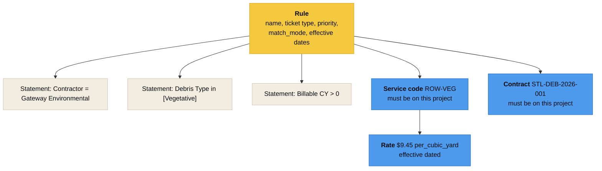
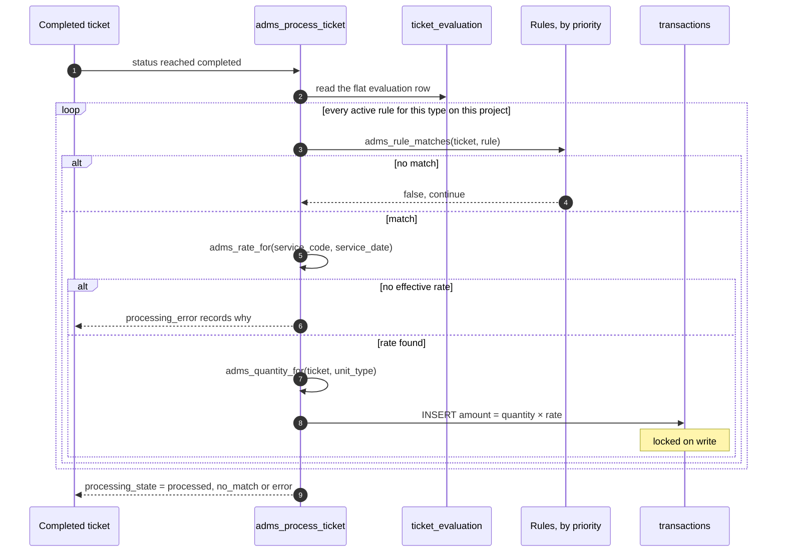

<div align="center">
<sub>

[Docs index](README.md) · [Architecture](ARCHITECTURE.md) · [Data model](DATA_MODEL.md) · [ERD](ERD.md) · [Ticket types](TICKET_TYPES.md) · **Rules** · [Access](ACCESS_CONTROL.md) · [Federation](FEDERATION.md) · [API](API.md) · [Deploy](DEPLOYMENT.md) · [Testing](TESTING.md) · [Troubleshooting](TROUBLESHOOTING.md)

</sub>
</div>

# The rules engine

A rule reads: **when these conditions hold on a completed ticket of this type, bill this service code under this contract.**


Every completed ticket is evaluated against **all** of the rules for its type on its project, so one ticket can produce several transactions. That is not an edge case. A load carrying household hazardous waste bills a volume rate and a flat segregation surcharge, which is two rules and two transactions off one ticket.

<br>

## The shape of a rule



| Column | Meaning |
|---|---|
| `ticket_type_id` | The rule only ever sees tickets of this type |
| `match_mode` | `all` means every statement must hold. `any` means one is enough |
| `priority` | Ascending. Lower numbers evaluate first |
| `stop_on_match` | When true, a match ends evaluation for that ticket. Default is false, so every rule gets a look |
| `effective_from` / `effective_to` | A rule that was not in force on the ticket's service date does not apply |
| `is_active` | Switch a rule off without deleting it and losing its history |

> [!IMPORTANT]
> **A rule cannot be saved without a service code and a contract, and both must already belong to the project.** This is enforced by `trg_rules_scope`, a `BEFORE INSERT OR UPDATE` trigger, not by the UI. `test_a_rule_cannot_be_saved_without_a_contract_on_the_project` covers it.

<br>

## Statements

A statement is `operand operator value`, with an optional `negate` flag. The value picker in the builder is populated from project bound options, so if three contractors are on the project, those three are what `Contractor =` offers.

Each statement stores a `value_label` captured at save time, so an audit reader three years later sees `Gateway Environmental Services` rather than a bare uuid whose row may have been renamed since.

### Operands

Every operand names a column on the `ticket_evaluation` view. Adding one is a row in `rule_operands`.

| Operand | Type | Reads | Limited to kinds |
|---|---|---|---|
| Contractor | uuid | `contractor_id` | all |
| Debris Type | text | `debris_type` | all |
| Debris Category | text | `debris_category` | all |
| Zone | text | `zone_code` | all |
| Destination Site | uuid | `destination_site_id` | all |
| Origin Site | uuid | `origin_site_id` | all |
| Destination Site Kind | text | `destination_site_kind` | all |
| Equipment Type | text | `equipment_type` | all |
| Truck | uuid | `equipment_id` | all |
| Ticket Status | text | `status` | all |
| Special Class | text | `special_class` | all |
| Severity | text | `severity` | `incident` |
| Haul Distance | number | `haul_miles` | all |
| Billable Cubic Yards | number | `billable_cubic_yards` | all |
| Net Tons | number | `net_tons` | all |
| Load Call | number | `load_call_pct` | `load`, `haul_out` |
| Labor Hours | number | `labor_hours` | `unit_rate` |
| Equipment Hours | number | `equipment_hours` | `unit_rate` |
| Unit Count | number | `unit_count` | `unit_rate` |
| Stump Diameter | number | `stump_diameter_inches` | `unit_rate` |
| Cycle Time | number | `cycle_minutes` | all |
| Photo Count | number | `photo_count` | all |
| Waypoint Count | number | `waypoint_count` | `load` |
| Service Date | date | `service_date` | all |
| Scale Ticket Number | text | `scale_ticket_number` | all |
| Created By | uuid | `created_by` | all |
| Entry Source | text | `source` | all |

`applies_to_kinds` is why the builder does not offer Load Call on a unit rate ticket. An empty array means the operand applies to every kind.

### Operators

| Operator | Symbol | Arity | Works on |
|---|---|---|---|
| equals | `=` | binary | uuid, text, number, boolean, date, timestamp |
| does not equal | `!=` | binary | uuid, text, number, boolean, date, timestamp |
| greater than | `>` | binary | number, date, timestamp |
| at least | `>=` | binary | number, date, timestamp |
| less than | `<` | binary | number, date, timestamp |
| at most | `<=` | binary | number, date, timestamp |
| is one of | `in` | set | uuid, text, number |
| is not one of | `not in` | set | uuid, text, number |
| between | `..` | range | number |
| contains | `~` | binary | text |
| starts with | `^` | binary | text |
| is empty | `null` | unary | any |
| is not empty | `!null` | unary | any |

The builder filters the operator list by the operand's `data_type`, so an invalid pairing is never offered.

<br>

## What happens when a ticket completes



Re-running the engine over an already processed ticket writes nothing. A partial unique index on ticket plus rule makes it idempotent, which is what lets the back office safely offer a **Process queued** button that drains the whole project.

### A ticket that matches nothing says so

A completed ticket that produced no transaction is monitored work that cannot reach an invoice. It used to sit in `processing_state = 'no_match'` with a NULL `processing_error`, which is a silent skip, and non billable types took the same path, so an incident looked identical to a project that was never rigged.

Three states now, and they mean three different things:

| State | What it means |
|---|---|
| `excluded` | The ticket type does not carry transactions. An incident, a survey, a right of entry. Recorded, not billed, by design |
| `no_match` with an error naming the type | No rule on this project covers that ticket type at all. Somebody has to write one |
| `no_match` with an error naming the date | Rules for that type exist and none of their conditions held, or none was effective on the service date |

`adms_flag_ticket` raises `no_rule_matched` at serious severity on the same finding, so it reaches the review queue the morning after rather than at invoice time. Non billable types are never flagged for it.

<br>

## No rule, no field work

A rule is what connects a service code to a transaction. A project with no rule covering an enabled ticket type cannot produce a transaction on any ticket of that type, so calling it ready for field work was the system asserting something untrue.

`project_readiness` computes coverage per ticket type rather than asking whether any rule exists anywhere:

| Column | What it holds |
|---|---|
| `unruled_ticket_types` | Enabled, active, billable, non system types with no active rule. **Blocks `ready_for_field`** |
| `unruled_service_codes` | Active codes no active rule references. Blocks `ready_for_billing` |
| `has_rule_coverage` | Both halves of the first, as one flag |

`adms_ticket_before_insert` refuses the ticket and names the type: *No rule covers Haul Out Ticket, so a ticket of that type could never be billed.* The wizard, the dashboard and the field app all read the same row, so none of them can disagree about it.

`missing` reports `rule_coverage` separately from `rule`. No rules at all and three types covered with one left over are different jobs for whoever has to fix them.

<br>

## Rules built from the contract

A contract line item already drives service code creation. Once the line is captured the rule is mostly derivable from it, so the derivable half is derived and the rest is asked for.

```http
POST /api/v1/projects/{project_id}/rules/from-line-items
```

Dry run by default, the same shape as the line item import and for the same reason: the answer is a table somebody reads and corrects, not a count of rules that appeared.

| Derived from | What it fills in |
|---|---|
| The line's own bridge | Service code, contract, contractor |
| `debris_types.ticket_type_codes`, intersected with what the project has enabled | Which ticket type bills it |
| The rate's unit type, where the debris stream does not say | Which ticket type bills it |
| The contractor and the debris stream | The base conditions |
| The rate's unit type | A quantity guard, so a rule cannot fire on a ticket that measured nothing |

Three kinds of line come back, and only one of them is ready to write:

- **standard**. Everything derived. Confirm and write.
- **tiered**. The line prices in bands. The boundaries are **asked for**, never read out of the line's wording, because being one mile wrong on a band is a silent pricing error on every haul that crosses it. A confirmed banded line writes one tiered rate with its bands on `rate_tiers` rather than a rule per band, because `adms_price_for` already reads them.
- **pass_through**. A tipping fee, a landfill or gate fee, anything at cost or cost plus. **Held back and not shaped at all.** How one is billed varies by contract: at cost, at cost plus a markup, a flat rate per ton, or paid by the client directly. A rule that looks right and bills wrong is the expensive failure here, so these go in front of a person with the question named.

Nothing is written until the second call carries confirmed proposals. An empty confirmation is refused rather than treated as "write them all".

<br>

## The rule map

`rule_map` puts the whole chain on one row: rule, ticket type, service code, the contract line it came from, the rate and how many bands it has, the contract, the contractor, and what the rule has produced. `problems` names the links that cannot bill, so the map can lead with those rather than burying them.

| Problem | What it means |
|---|---|
| `no_rate` | The code has no rate in effect. The rule matches and writes nothing |
| `tiered_without_bands` | Priced in bands with no bands written |
| `code_inactive` | The service code is retired |
| `rule_inactive` | The rule is switched off |
| `expired` | The rule stopped being effective before today |

`PATCH /api/v1/rules/{rule_id}` changes one link without touching the statements. `PUT` replaces them, which is right when somebody is editing the conditions and wrong when they are fixing a service code from the map.

<br>

## Quantity is never typed by a human

The rate carries a unit type. The unit type names a column on `ticket_metrics`. The engine reads that column.

| Unit type | Reads | Derived from |
|---|---|---|
| `per_cubic_yard` | `billable_cubic_yards` | certified capacity × load call % |
| `per_ton` | `net_tons` | net weight, else gross − tare, ÷ 2000 |
| `per_mile` | `haul_miles` | odometer, else waypoint path, else straight line origin to destination |
| `per_labor_hour` | `labor_hours` | recorded on the ticket |
| `per_equip_hour` | `equipment_hours` | recorded on the ticket |
| `per_unit` | `unit_count` | `tickets.quantity`, else 1 |
| `per_each` / `flat` | `each` / `flat` | always 1 |
| `per_diameter_in` | `stump_diameter_inches` | `tickets.data` |
| `per_linear_foot` | `linear_feet` | `tickets.data` |

Where a ticket carries no measurable value for the unit type, the quantity defaults to 1. That is the difference between a flat fee that bills and a transaction that silently comes out as zero.

<details>
<summary><b>Adding a tenth unit type</b></summary>
<br>

1. Add the derived column to the `ticket_metrics` view in a new migration.
2. `INSERT INTO unit_types (code, label, quantity_source) VALUES ('per_square_foot', 'Per square foot', 'square_feet');`
3. Nothing else. The engine reads `quantity_source` at evaluation time, so no function needs editing.

</details>

<br>

## Rates are effective dated

`adms_rate_for(service_code, on_date)` returns the rate in force on the ticket's **service date**, not today's date.

A mid project rate change is a new `rates` row with a new `effective_from`. Transactions already computed keep the number they were computed with, because the rate they used is snapshotted onto the transaction row. `test_a_new_rate_supersedes_the_old_one_without_rewriting_history` is the assertion.

> [!CAUTION]
> A rule that matches but finds no effective rate does not fail silently. The ticket's `processing_error` records the reason, and it shows in the processing queue as unprocessed rather than as billed. Check there first when a ticket you expected to bill did not.

<br>

## Transactions are locked on write

| Property | How |
|---|---|
| No edits | `trg_transactions_immutable` raises `restrict_violation` on `UPDATE` and `DELETE` |
| No edits through the API either | `test_transactions_are_immutable_through_the_api` |
| One per ticket per rule | Partial unique index |
| Reversible, not erasable | `adms_reverse_transaction` writes a negating row. The original is untouched, and both stay in the ledger |
| A reversal needs a reason | `test_reversal_requires_a_reason` |
| Invoicing does not mutate them | `invoice_lines` joins to the transaction rather than flagging it |

Each transaction carries a snapshot of the ticket and of the rule it was computed from, plus the `quantity_source` that produced the number. An auditor reading it three years later does not need the rule to still exist in its original form.

<br>

## Testing a rule before you trust it

```http
POST /api/v1/rules/{rule_id}/test
```

A dry run. It reports how many tickets on the project would match and what they would bill, and it **writes nothing**. The Dry run button on each rule card in the back office calls this. `test_rule_dry_run_reports_matches_without_writing` asserts the writing nothing part.

<br>

## Worked example

Four rules on Load Ticket, from the demo project:

| Rule | Priority | Conditions | Bills |
|---|---|---|---|
| ROW Vegetative Load | 10 | Contractor = Gateway Environmental, Debris Type in Vegetative, Site Kind in DMS, Billable CY > 0 | `ROW-VEG` at $9.45 / CY |
| ROW C&D Load | 20 | Contractor = Gateway Environmental, Debris Type in C&D or mixed, Billable CY > 0 | `ROW-CD` at $11.25 / CY |
| ROW HHW Volume | 25 | Debris Type = Household Hazardous Waste, Billable CY > 0 | `ROW-CD` at $11.25 / CY |
| HHW Segregation Surcharge | 30 | Debris Type = Household Hazardous Waste | `HHW` at $285.00 each |

A load of household hazardous waste matches rules 25 and 30 and produces two transactions: the volume rate on the derived cubic yards, and the flat handling fee. Neither rule sets `stop_on_match`, which is what makes that work.

<br>

## Related reading

| | |
|---|---|
| [Legacy rule editor analysis](RULES_AND_TRANSACTIONS.md) | The design notes behind this engine, including the screen by screen study of the incumbent editor, the control to schema map, and the known gaps |
| [Ticket types](TICKET_TYPES.md) | Where the operand values come from |
| [Data model](DATA_MODEL.md) | The tables and functions named above |

<br>

<div align="center">
<sub>

**[Docs index](README.md)** · **[Repository](../README.md)**

</sub>
</div>
