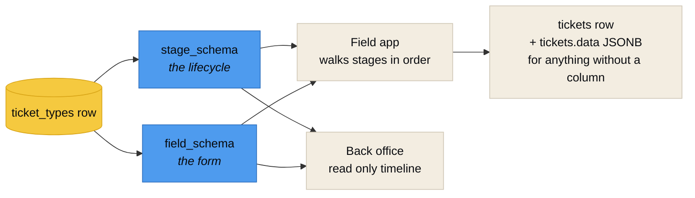
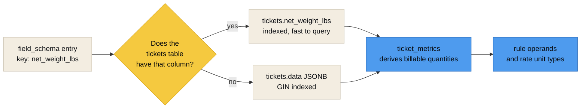

<div align="center">
<sub>

[Docs index](README.md) · [Architecture](ARCHITECTURE.md) · [Data model](DATA_MODEL.md) · [ERD](ERD.md) · **Ticket types** · [Rules](RULES_ENGINE.md) · [Access](ACCESS_CONTROL.md) · [Federation](FEDERATION.md) · [API](API.md) · [Deploy](DEPLOYMENT.md) · [Testing](TESTING.md) · [Troubleshooting](TROUBLESHOOTING.md)

</sub>
</div>

# Ticket types

**A ticket type is data, not code.** Each row in `ticket_types` declares its own lifecycle and its own form as JSON. The field app and the back office render entirely from those two documents, so adding a type is an `INSERT` rather than a release.

That single decision is what lets one codebase serve a county running right of way collection, a monitoring firm running haul out and unit rate work, and a contract that invents something neither of them has seen.

<br>

## What ships

| Code | Kind | What it is | Billable |
|---|---|---|---|
| `LOAD` | `load` | Debris collected at a right of way or right of entry location and hauled to a debris management site. Two monitors, two locations, one barcode between them | Yes |
| `HAULOUT` | `haul_out` | Reduced or staged debris leaving a DMS for a final disposal site | Yes |
| `UNIT` | `unit_rate` | Work priced per unit rather than per load: hangers, leaners, stumps, hazardous trees | Yes |
| `INCIDENT` | `incident` | Something happened that has to be on the record. Photographed, categorised, severity ranked | No |
| `ROE` | `custom` | Right of Entry. A worked example of a single stage type with a signature capture | No |
| `TM` | `custom` | Time and Material. A worked example of labor and equipment hours | Yes |
| `SURVEY` | `custom` | Damage Survey. A worked example of an assessment form | No |
| `PENDING_COLLECTION` | `pending` | **System type.** The transient object a driver carries from the loading monitor to the disposal monitor | No |
| `PENDING_DISPOSAL` | `pending` | **System type.** The same, for the haul out leg | No |

> [!WARNING]
> The two `pending` types are hidden. A `BEFORE INSERT` trigger on `project_ticket_types` refuses to let either one be added to a project, and the API refuses to edit them. They exist so the barcode handoff has a real row to live on, not so anyone creates one by hand.

<br>

## The two schemas



### `stage_schema`

An ordered array. Each entry is one step in the lifecycle.

| Key | Type | Meaning |
|---|---|---|
| `code` | string, required | Unique within the type. Written to `ticket_stages.stage_code` |
| `label` | string | What the field app shows in the header |
| `sequence` | integer | Order. The field app walks these ascending |
| `actor_role` | string | Which role is expected to perform this stage |
| `required` | boolean | A stage that may be skipped sets this false |
| `completes_ticket` | boolean | Saving this stage moves the ticket to `completed` and triggers `adms_process_ticket` |
| `instructions` | string | Shown to the monitor at the top of the stage |
| `captures` | array | Declares what this stage collects, which drives the built in capture widgets |

Recognised `captures` values: `equipment`, `barcode`, `gps`, `origin_address`, `origin_site`, `site`, `debris_type`, `load_call`, `photo`, `scale`, `signature`, `waypoints`, `monitor`, `crew`, `quantity`.

> [!IMPORTANT]
> **At least one stage must set `completes_ticket`.** The API rejects a type without one, because a ticket that can never complete can never bill and can never close out. `test_a_stage_schema_without_a_completing_stage_is_rejected` covers it.

### `field_schema`

A flat array. Each entry is one input, bound to one stage.

| Key | Type | Meaning |
|---|---|---|
| `key` | string, required | Unique within the type. Maps to a ticket column where one exists, otherwise to `tickets.data` |
| `label` | string | The field label |
| `type` | string | Chooses the input. See the table below |
| `stage` | string, required | Must match a `code` in `stage_schema` |
| `required` | boolean | Enforced by the client and re-checked by the API |
| `source` | string | For `select`. Names a project scoped option list |
| `filter` | object | Narrows the option list, for example `{"site_kind": ["DMS", "TDSRS"]}` |
| `unit` | string | Shown as a suffix, for example `CY` or `lbs` |
| `min` / `max` | number | Range for `number` and `percent` |
| `help` | string | Shown under the input |

**Field types and what the field app renders:**

| `type` | Rendered as |
|---|---|
| `text` | Single line input |
| `textarea` | Multi line input |
| `number` | Numeric input with the declared unit |
| `percent` | Load call buttons plus a slider |
| `select` | Picker populated from `source`, filtered by `filter` |
| `boolean` | Toggle |
| `datetime` | Date and time picker, defaulting to the moment the stage is saved |
| `gps` | Captured automatically, with accuracy and a manual refresh |
| `photo` | Opens the camera |
| `barcode` | Scanner, with manual entry as a fallback |
| `signature` | Draw to sign |

**Option sources for `select`:** `project_contractors`, `project_contracts`, `project_sites`, `project_zones`, `project_equipment`, `project_workers`, `project_service_codes`, `project_ticket_types`, `debris_types`, `debris_categories`, `ticket_statuses`, `incident_categories`, `incident_subcategories`, `site_kinds`, `equipment_types`, `severities`, `ticket_sources`.

<br>

## Writing a new type

<details open>
<summary><b>A minimal single stage type</b></summary>
<br>

```json
{
  "code": "ROE",
  "label": "Right of Entry",
  "kind": "custom",
  "stage_schema": [
    {
      "code": "intake", "label": "Intake", "sequence": 1,
      "actor_role": "monitor", "required": true, "completes_ticket": true,
      "instructions": "Confirm the property, capture the owner signature, photograph the frontage.",
      "captures": ["gps", "signature", "photo"]
    }
  ],
  "field_schema": [
    {"key": "owner_name", "label": "Property Owner", "type": "text",
     "required": true, "stage": "intake"},
    {"key": "parcel_id", "label": "Parcel ID", "type": "text",
     "required": false, "stage": "intake"},
    {"key": "owner_signature", "label": "Signature", "type": "signature",
     "required": true, "stage": "intake"}
  ]
}
```

</details>

<details>
<summary><b>A two stage type with a barcode handoff</b></summary>
<br>

The `LOAD` type is the reference. Stage one is opened by the loading monitor, the ticket is handed off on a barcode, stage three is closed by the disposal monitor at the site.

```json
{
  "code": "LOAD", "label": "Load Ticket", "kind": "load",
  "requires_equipment": true, "requires_barcode": true,
  "requires_photo": true, "supports_waypoints": true, "billable": true,
  "stage_schema": [
    {"code": "collection", "label": "Collection", "sequence": 1,
     "actor_role": "monitor", "required": true, "completes_ticket": false,
     "instructions": "Scan the truck placard, confirm the certified capacity, then watch the load.",
     "captures": ["equipment", "barcode", "gps", "origin_address", "debris_type", "monitor"]},
    {"code": "transit", "label": "In Transit", "sequence": 2,
     "actor_role": "monitor", "required": false, "completes_ticket": false,
     "instructions": "Add a waypoint whenever the truck changes route or stops.",
     "captures": ["waypoints"]},
    {"code": "disposal", "label": "Disposal", "sequence": 3,
     "actor_role": "monitor", "required": true, "completes_ticket": true,
     "instructions": "Scan the same barcode at the site, call the load, photograph the bed.",
     "captures": ["site", "debris_type", "load_call", "photo", "scale", "monitor", "gps"]}
  ]
}
```

The full `field_schema` for this type is in [`database/seeds/002_ticket_types.sql`](../database/seeds/002_ticket_types.sql).

</details>

### Three ways to create one

| Path | When |
|---|---|
| **Ticket Catalog screen** in the back office | Normal use. Admin only. Validates before saving |
| `POST /api/v1/ticket-types` | Scripted or migrated setups. Same validation |
| A row in a seed or migration | Types you want to ship with the deployment |

Then enable it on a project: `POST /api/v1/projects/{id}/ticket-types`, or the Project Setup screen.

> [!TIP]
> A new type bills through the same engine with no code change. That claim is asserted, not assumed. `test_a_new_ticket_type_is_added_as_data` creates a type, enables it, files a ticket against it, and checks that a rule produced a locked transaction.

<br>

## Where the values land



Either way the value is queryable, reportable and addressable by a rule. Common columns are first class because they index and query fast at a hundred thousand tickets. Anything a type invents lands in `data`, and adding it as a rule operand is a row in `rule_operands`.

<br>

## Validation the API applies

| Check | Message |
|---|---|
| Every stage has a `code` | `Stage {n} is missing a code` |
| Stage codes are unique | `Duplicate stage code '{code}'` |
| At least one stage completes the ticket | Rejected, with the reason |
| Every field has a `key` | `Field {n} is missing a key` |
| Field keys are unique | `Duplicate field key '{key}'` |
| Every field's `stage` exists in `stage_schema` | Rejected, naming the stage |
| System types are never edited | `System ticket types cannot be edited` |

The database adds its own: `kind` must be one of `load`, `haul_out`, `unit_rate`, `incident`, `pending`, `custom`. Both schemas must be JSON arrays. A system type can never be billable.

<br>

<div align="center">
<sub>

**[Docs index](README.md)** · **[The rules engine](RULES_ENGINE.md)** · **[Repository](../README.md)**

</sub>
</div>
