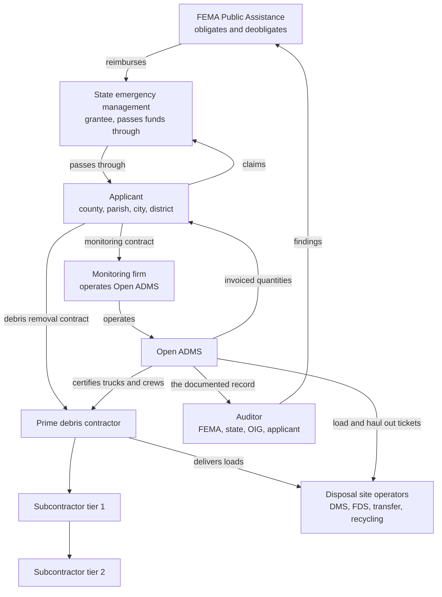

# 01. Product Definition

## What Open ADMS is

Open ADMS is a self hosted Automated Debris Management System. It records every
load of debris and every unit of hazard work from the moment a monitor starts
watching it to the moment it is billed, and it keeps that record in a form that
survives an audit years later.

The atomic unit is the ticket. A ticket binds a project, a piece of certified
equipment, a monitored event, a location, a time, a person, and a measurement.
Everything else in the system exists to make tickets trustworthy, to turn them
into money, or to prove after the fact that they were what they claim to be.

## The problem it solves

After a declared disaster, a local government (the applicant) hires a debris
contractor to remove debris and a separate monitoring firm to watch the
contractor work. FEMA reimburses the applicant under Public Assistance for
eligible debris, but only against documentation. The monitoring record is that
documentation.

Three properties decide whether the money survives.

1. **Completeness.** Every load has a ticket, every ticket has a certified
   truck, a load call, a location inside the approved boundary, and two
   independent monitors.
2. **Integrity.** Nothing in the record was changed after the fact without a
   trace. A closed transaction is not editable. An edit to a ticket is visible
   with its before value, its after value, its author, and its reason.
3. **Consistency.** The quantity billed derives from the recorded measurement
   by a stated rule, not from someone typing a number.

When those fail, the applicant is deobligated: FEMA claws back reimbursement,
sometimes years later, and the applicant looks to the monitoring firm. Open
ADMS exists to make those three properties structural rather than procedural.

## Where it sits in the industry

The platform is operated by the monitoring firm, but the record it produces is
the applicant's evidence, the contractor's payment basis, and the auditor's
subject. Every design decision that trades away traceability for convenience is
paid for by one of those three parties later.

## The two surfaces and one API

| Surface | Who uses it | Conditions it works in |
|---|---|---|
| **Field app** | Monitors on a right of way, at a disposal site, or with a hazard crew | Handheld, one thumb, sunlight, gloves, intermittent or absent cell coverage, a full shift on battery |
| **Back office** | Data managers, analysts, administrators | Desktop, keyboard, multiple monitors, always connected |

Both render from the same catalog and write through the same API. Neither hard
codes a ticket type. A deployment is a sovereign instance: it owns its data,
holds its own keys, and shares records with peer instances only by explicit
signed agreement.

## Actors

The industry has more roles than the system currently has. This section names
the industry actors. `07-access-control.md` maps them onto system roles and
permissions.

### Field actors

| Actor | What they do | Primary surface |
|---|---|---|
| **Collection monitor** | Rides the right of way with a loading crew. Opens a load ticket, verifies the truck against its certification, records the pickup location, watches the load, hands the driver a control ticket. | Field app |
| **Disposal monitor** (tower monitor) | Stands at a debris management site. Scans the inbound control ticket, verifies the physical truck against the cached certification photo, calls the load percentage, and closes the ticket. | Field app |
| **Haul out monitor** | Opens an outbound haul out at a DMS after reduction, or closes one at a final disposal site against a bill of lading. | Field app |
| **Unit rate monitor** (LHS monitor) | Documents hazard work: hangers, leaners, stumps, and other per unit tasks. Works a phased pre-work, measure, post-work sequence and prints the crew copy on site. | Field app |
| **Certification monitor** (measurer) | Certifies trucks and crews before they may work: measures bed volume, photographs the vehicle from four angles, records driver and insurance verification. | Field app |
| **Field supervisor** | Verifies anomalies raised against monitors, re-routes assets found outside the boundary, resolves lockouts, and is the escalation target for a stalled sync queue. | Field app and back office |

### Office actors

| Actor | What they do | Primary surface |
|---|---|---|
| **Data manager** | Clears the exception queue, reconciles pending collection against pending disposal, marries mismatched records, and audits the map hourly against the project boundary. | Back office |
| **Regional data manager** | Owns credentials, project lookup tables, service codes, and boundary schemas across projects. The escalation target for an unknown service code, an out of envelope measurement, or a truck not in the project. | Back office |
| **Billing analyst** | Maintains rules, rates and contracts. Processes transactions and assembles invoices. | Back office |
| **Project manager** | Approves decisions with contractual consequence: an out of bounds pickup, a boundary schema change, a void and replace. | Back office |
| **Administrator** | Manages the instance, users, the ticket type catalog, and peer relationships. | Back office |
| **Database administrator** | Executes hard deletions that the application layer refuses. Reached by an escalation manifest, never by a UI action. | Outside the application |

### External actors

| Actor | Relationship to the system |
|---|---|
| **Applicant representative** | The county or city staff member who signs the contract, holds the disposal site permits, and receives the invoiced quantities. Reads the record, does not create tickets. |
| **Contractor representative** | Signs truck and crew certifications, receives receipt copies, disputes quantities. |
| **Truck driver** | Not a system user. Carries the physical control ticket between two monitors, receives a printed receipt, and is identified on the record by name and truck number. |
| **Crew supervisor** | Not a system user. Identified on unit rate tickets by certification number and name, photographed with the crew placard. |
| **Auditor** | Reads the record after the fact, often years later, usually through exports rather than the application. Never writes. |
| **Peer instance** | Another Open ADMS deployment reading shared records over a signed request. A machine actor with no interactive session. |

## Scope of v1.0

### In scope

| Area | What v1.0 includes |
|---|---|
| Ticket capture | Load, haul out, unit rate and LHS, incident report, truck certification, crew certification, and any additional type declared as catalog data |
| Two monitor chain of custody | Physical control ticket handoff, barcode claim at the receiving end, pending state on both sides |
| Evidence | Real photo capture with storage, retake in place, signature capture, attestation before commit, barcode scanning |
| Measurement | Certified truck volume, load call percentage, scale weight, haul distance, unit counts, hazard diameters |
| Billing | Project scoped service codes, effective dated rates with unit types, rule evaluation on completion, immutable transactions, invoices |
| Oversight | Immutable audit history, the exception and anomaly engine, pending reconciliation, the stoplight dashboard |
| Geospatial | Project boundary and zone polygons, road ownership polylines, live asset and ticket layers, spatial query and export, external portal integration |
| Access control | Per role, per project, per ticket type authorization enforced in the database |
| Field conditions | Full offline capture with idempotent replay, sync queue visibility per payload class, device and safety policy |
| Output | Physical receipt printing including multi copy and reprint, CSV and GeoJSON export |
| Portability | Runs on any Postgres. PostGIS optional. One database variable, one API variable. |
| Federation | Sovereign instance identity, signed peer reads, per record visibility |

### Out of scope for v1.0

| Excluded | Reason |
|---|---|
| Contractor facing portal | The contractor is a subject of the record, not a user of it. Receipts and disputes flow through the monitoring firm. |
| Applicant self service portal | Applicant access in v1.0 is export and report, not an interactive surface. |
| Payroll, timekeeping, scheduling | Adjacent products. The system records who monitored what, not who is owed wages. |
| Automated FEMA form generation | Exports feed it. Generating PW forms is a downstream concern with its own compliance surface. |
| Native mobile applications | The field app is a progressive web app. Native store distribution is a packaging decision, not a v1.0 requirement. |
| Mobile device management | The device policy is specified as requirements on the application. Enforcing it on the hardware is the deploying organization's MDM. |
| Real time contractor equipment telematics | Asset positions come from monitor devices, not from third party truck telematics feeds. |
| Multi language interface | English only in v1.0. |

### Explicit non goals

These are not deferred, they are rejected.

1. **Manual quantity entry.** No human types the billable quantity. Quantity
   derives from recorded measurement by the rate's unit type, or defaults to
   one. A workflow that requires typing a quantity is a defect.
2. **Editable transactions.** A correction is a reversal plus a recomputation.
   Both stay in the ledger.
3. **Deletable history.** Audit rows and transactions are append only at the
   database level. No role, and no direct database session through the
   application's credentials, changes that.
4. **Client enforced invariants.** Any rule that protects the integrity of the
   record is enforced in the database. The interface may also enforce it for
   good feedback, but the database is what makes it true.
5. **Code changes to add a ticket type.** A new ticket type is a row. If a
   contract invents a form next season, adding it is configuration.

## Success criteria for v1.0

1. A monitor with no signal for a full shift captures a complete day of
   tickets, and every one of them reaches the server without duplication when
   coverage returns.
2. A load ticket created by one monitor and closed by another produces a
   locked transaction with a quantity that no person typed.
3. A data manager clears a shift's exceptions from a single queue, and every
   resolution leaves an audit artifact naming who decided what and why.
4. An auditor handed an export can reconstruct any ticket's full history:
   every field's value at every point, who changed it, and why.
5. A new ticket type is added to a live deployment without a release.
6. The deployment runs on a Postgres without PostGIS with no loss of function
   other than spatial index performance.

## Glossary

| Term | Meaning |
|---|---|
| **ADMS** | Automated Debris Management System. |
| **Applicant** | The local government entitled to reimbursement. The client on a project. |
| **Bill of lading** | The document accompanying an outbound haul out load, photographed at the final disposal site. |
| **Category A** | FEMA Public Assistance debris removal category. |
| **Control ticket** | The sequentially numbered physical ticket from a paper book, carried by the driver, that binds a collection event to a disposal event. |
| **CY** | Cubic yard. |
| **Deobligation** | FEMA withdrawing previously obligated reimbursement, usually after audit findings. |
| **DMS** | Debris Management Site. A temporary site where debris is staged and reduced. Formerly and still commonly called TDSRS. |
| **FDS** | Final Disposal Site. Landfill, mulch market, or other terminal destination. |
| **Hanger** | A broken limb suspended in a tree, billed per unit above a minimum diameter. |
| **Leaner** | A damaged tree leaning at risk, billed per unit above a minimum diameter. |
| **LHS** | Leaner, Hanger, Stump. The hazard tree work class. |
| **Load call** | The monitor's estimate of how full a truck bed is, as a percentage of certified capacity. The basis of volumetric billing. |
| **Monitor** | The field worker who observes and documents contractor work. |
| **Placard** | The physical identification board displayed on a certified truck showing its number and capacity. |
| **Preload** | Debris loaded at the end of a shift and disposed of the following day. A legitimate cause of an overnight pending collection. |
| **PW** | Project Worksheet. The FEMA document capturing a scope of work and its cost. |
| **ROE** | Right of Entry. Property owner authorization to work on private property. |
| **ROW** | Right of Way. The public strip where most collection occurs. |
| **Scale ticket** | The weight ticket issued by a certified scale, referenced by number on the ticket. |
| **Stump** | A removed tree base, billed by diameter class. |
| **Tare weight** | Empty vehicle weight, subtracted from gross to get net. |
| **TDSRS** | Temporary Debris Storage and Reduction Site. Legacy name for a DMS. |
| **Tower** | The elevated station at a disposal site from which the disposal monitor calls loads. |
| **Truck certification** | The measured and photographed record establishing a vehicle's billable capacity. Prerequisite to that vehicle appearing on any ticket. |
| **Unit rate** | Work billed per discrete item rather than per volume or weight. |
| **Void and replace** | The correction pattern for an issued document: the original is marked void and retained, a replacement references it. |
| **Waypoint** | A GPS point recorded along a load's route, used to derive haul distance. |
