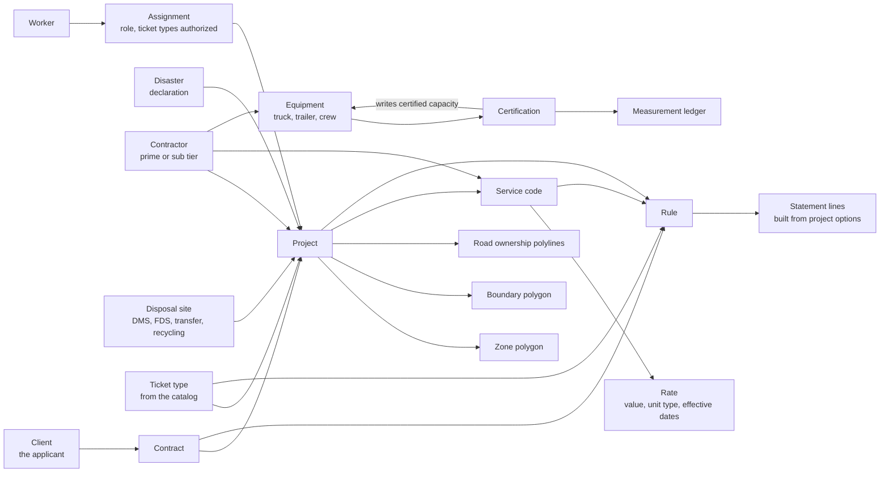
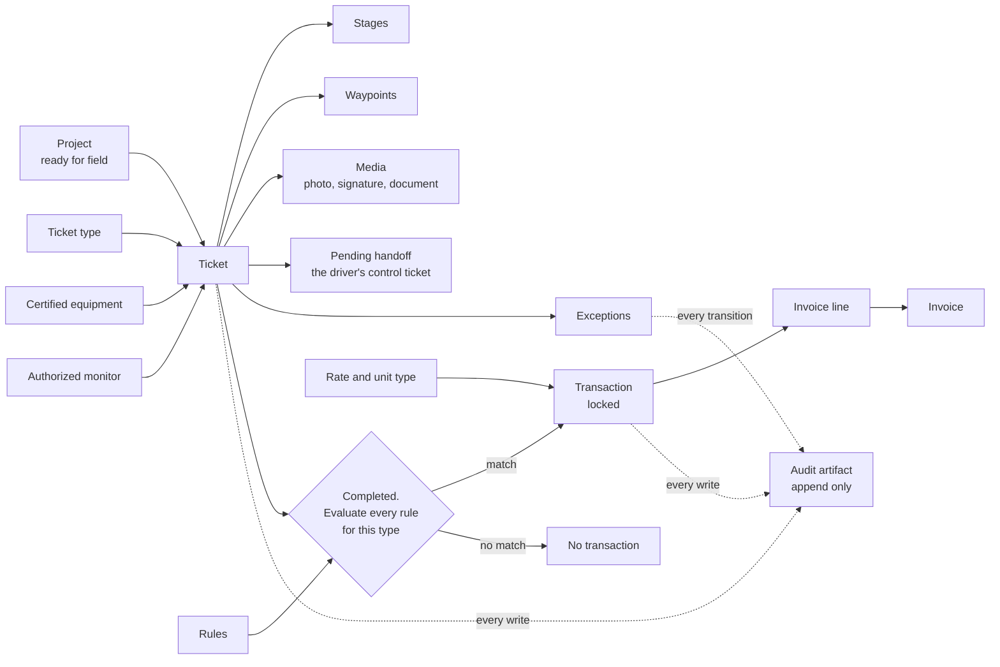
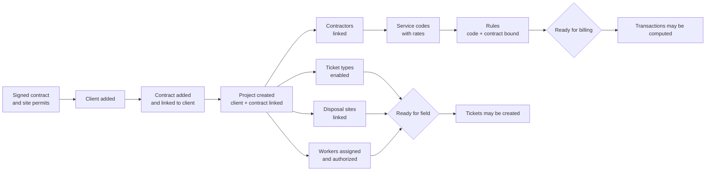
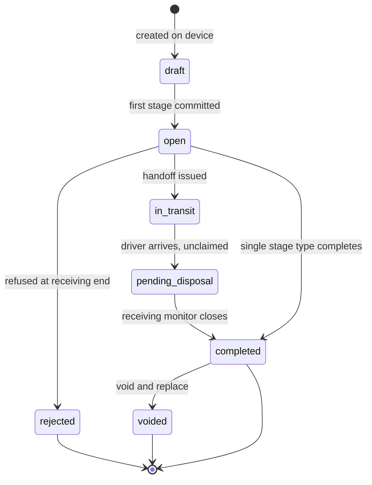
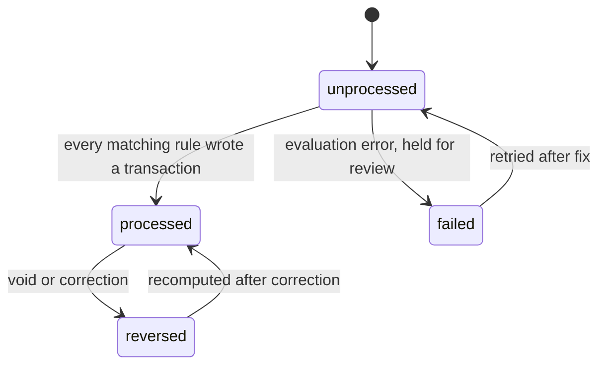
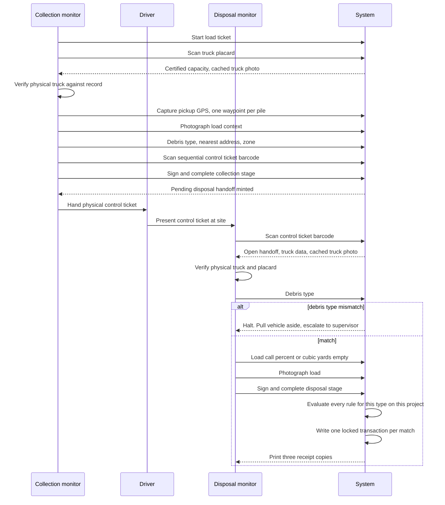
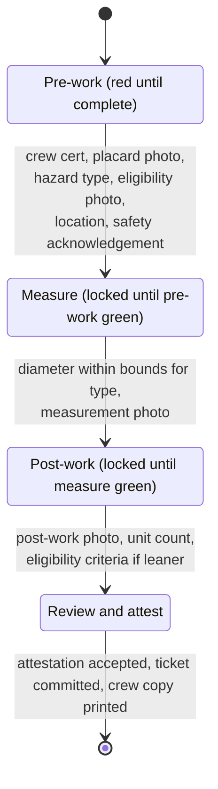
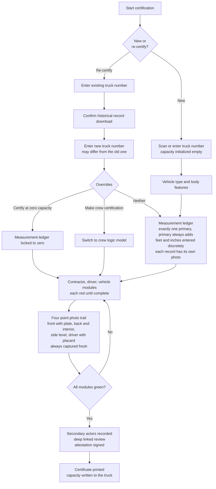
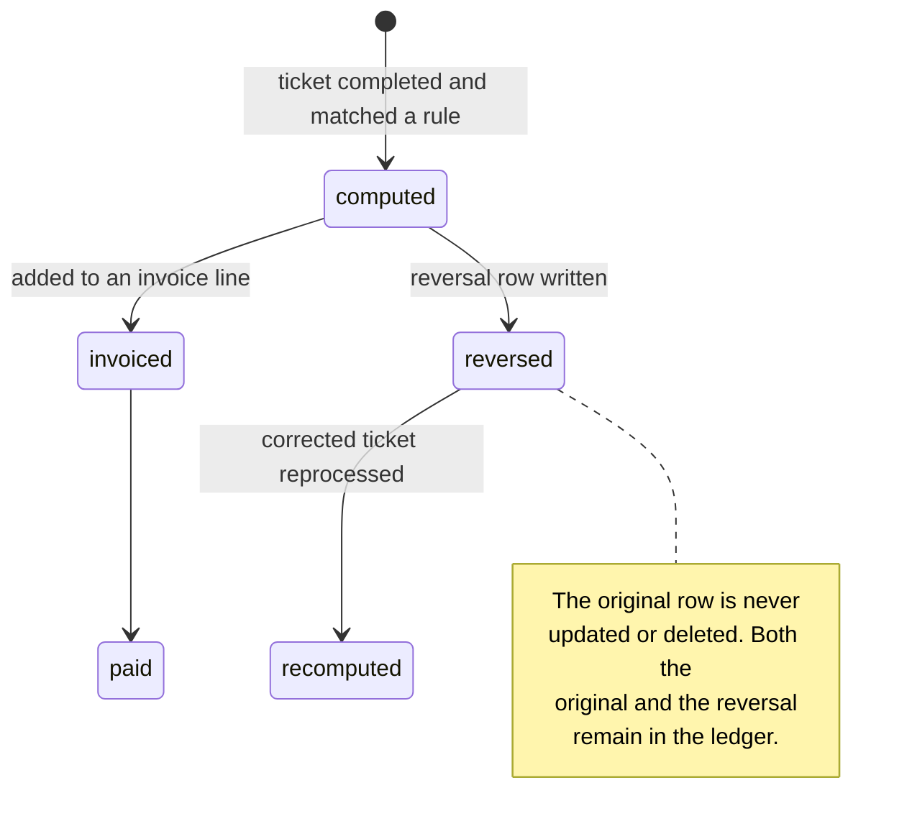
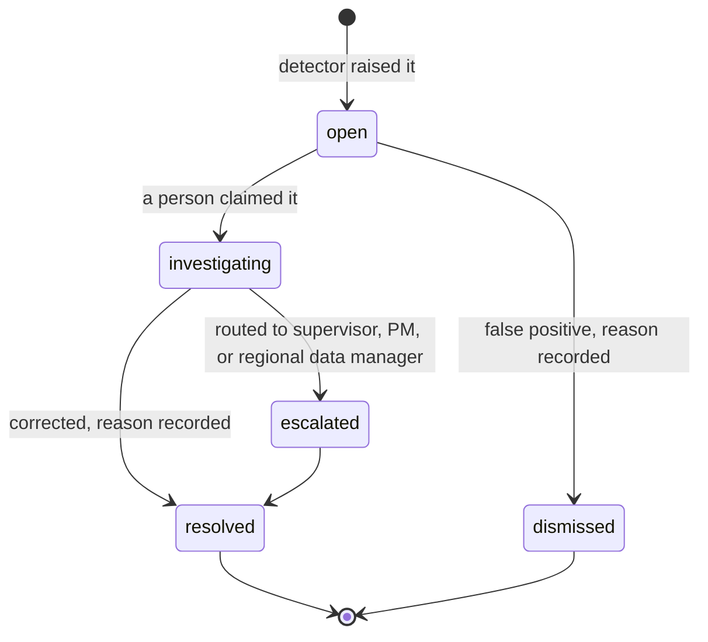

# 02. Domain Model

The vocabulary the rest of the spec is written in. Every term here is an
industry concept first and a database concept second. Where the current
implementation names something differently, the implementation name is noted so
the two can be reconciled.

## Entity map

Two views. The first is what must exist before anyone can work. The second is
what happens once they do.

### Configuration: composing a project

### Operations: a ticket becoming money and record

## Entities

### Instance level

Created once for a deployment and linked into any number of projects.

| Entity | Definition |
|---|---|
| **Instance** | One deployment. Holds a unique key and a signing key pair. Exactly one exists per database. Its identity is what makes a shared record attributable. |
| **Client** | The applicant. The county, parish, city or district entitled to reimbursement. Owns the contract and the disposal site permits. |
| **Contractor** | A company performing debris work. Carries a tier: prime, tier 1 subcontractor, tier 2 subcontractor. Tier matters because certification and payment both flow through the tier chain. |
| **Contract** | A signed agreement between a client and a contractor. A rule cannot bill without naming one. A contract is linked to a project separately from the contractor. |
| **Disposal site** | A permitted location where debris is delivered. Kinds: `DMS` (staging and reduction, formerly TDSRS), `FDS` (final destination), `TRANSFER`, `RECYCLING`. A site's kind determines which ticket archetypes may terminate there. |
| **Equipment** | A physical asset with a unit number: truck, trailer, grapple, loader, chipper, grinder, excavator, or crew. Its certified capacity is the basis of volumetric billing. Belongs to exactly one contractor. |
| **Disaster** | The declaration the work is performed under. Carries the federal identifier that appears on every ticket. |
| **Worker** | A person who uses the system. Carries a monitor ID distinct from the internal identifier, because the monitor ID is what is printed on tickets and matched to a physical badge. |
| **Ticket type** | A catalog entry declaring a lifecycle and a form as data. Adding a type is configuration, not a release. |

### Project level

| Entity | Definition |
|---|---|
| **Project** | The operating unit. Binds one client, one or more contracts, contractors, sites, zones, ticket types and workers. Carries the ticket number prefix and the timezone. A project that is not fully configured cannot receive tickets. |
| **Zone** | A subdivision of the project area. Used for routing, reporting and rule statements. In v1.0 a zone carries a polygon, not just a code. |
| **Boundary** | The polygon defining where work is authorized. Every ticket location and every asset position is evaluated against it. |
| **Road ownership layer** | Polylines classifying maintenance responsibility: city, county, state, private, federal. Determines eligibility as much as the boundary does. |
| **Service code** | A billable line of work, scoped to a project and tied to one contractor on that project. |
| **Rate** | A value plus a unit type plus effective dates. The unit type names the measurement the quantity comes from. Rates are effective dated so a mid project change never rewrites a computed transaction. |
| **Rule** | A statement of when a service code applies. Bound to one ticket type, one service code and one contract. Composed of statement lines built from project scoped options. |
| **Statement line** | One condition: an operand, an operator, and a value. Stores the human readable label of the value at save time so an audit reader sees a contractor name, not an identifier. |
| **Assignment** | A worker's authorization on a project. Carries the project role, whether they may create tickets, whether they may review, and in v1.0 which ticket types they are authorized for. |

### Operational records

| Entity | Definition |
|---|---|
| **Certification** | The record establishing that a truck or crew may work. For a truck it carries a measured volume and a four point photographic audit trail. For a crew it carries the certification number, supervisor, driver license and insurance verification. Certification is dated and expires. |
| **Measurement** | One geometric record inside a truck certification: a dimension in feet and inches, an operator (add or subtract), and a correlated photo. Exactly one measurement per certification is flagged primary, and a primary measurement always adds. |
| **Ticket** | The record of one monitored event. Carries the common columns first class and anything its type invents as structured data. |
| **Stage** | One instance of a lifecycle step on a ticket: who, where, when, what was recorded. |
| **Waypoint** | A GPS point along a route. The basis of derived haul distance when no odometer value exists. |
| **Media** | A photo, signature, scan or document bound to a ticket and usually to a stage. One is primary. Every media item carries its capture time and location. |
| **Pending handoff** | The transient object a driver carries between two monitors. Keyed by the physical control ticket barcode. Not a ticket type a project can enable. |
| **Exception** | A detected defect in the record: a date outside the project window, a location outside the boundary, an unknown truck, a measurement outside envelope, an unknown service code, an incomplete transaction, a duplicate number, or an anomalous monitor output pattern. Carries a domain, a priority, a state and a resolution. |

### Money and record

| Entity | Definition |
|---|---|
| **Transaction** | The computed billable record produced when a completed ticket matches a rule. Carries a snapshot of the ticket and the rule it was computed from, and the quantity source that produced the number. Permanently locked. |
| **Invoice** | A collection of transactions moving through draft, submitted, approved, paid. Totals are maintained by the system, not typed. |
| **Audit artifact** | An append only record of one change: entity, action, actor, before, after, computed difference, reason, request identifier. Every write in the system produces one. |

## Ticket archetypes

An archetype is the shape of a lifecycle. Several ticket types can share one.

| Archetype | Monitors | Lifecycle shape | Billable basis | Status |
|---|---|---|---|---|
| **Load** | Two, at different places and times | Collection stage, physical handoff, disposal stage | Volume from certified capacity times load call, or weight from scale | Built |
| **Haul out** | Two, at different places and times | Open at DMS after reduction, close at FDS against a bill of lading | Volume or weight, plus haul distance | Built |
| **Unit rate / LHS** | One, on site, phased | Pre-work, measure, post-work, attestation, print | Unit count or diameter | Partial, phase gating missing |
| **Incident report** | One | Single capture with categorization, severity, evidence, stakeholders | Not billable | Built |
| **Truck certification** | One certification monitor plus a contractor witness | Vehicle identity, measurement ledger, four point photos, attestation, print | Not billable. Produces the capacity other tickets bill against | Missing |
| **Crew certification** | One certification monitor plus a contractor witness | Contractor, driver, vehicle, photos, attestation, print | Not billable | Missing |
| **Custom** | Declared by the type | Whatever the type's stage schema declares | Whatever the rate's unit type reads, else one | Built |

Two archetypes are system owned and cannot be added to a project: **pending
collection** and **pending disposal**. They are the two halves of a handoff seen
from opposite ends, and they exist only until the halves are matched.

## State machines

### Project setup dependency order

Field work is blocked until the project is ready. The order is not a
convention, it is a gate enforced before a ticket may be inserted.

Ready for field and ready for billing are separate gates. A project can capture
tickets before its rules exist; those tickets sit unprocessed until they do.

### Ticket status

A voided ticket is never removed. Its transactions are reversed, not deleted,
and the replacement references it.

### Processing state

Separate from status, because a ticket can be complete and unbilled.

Processing is idempotent. Running it twice over the same ticket produces the
same transactions, not duplicates.

### Load ticket, two monitor chain of custody

### Haul out

Same chain, different endpoints. Opens at a DMS after reduction, closes at a
final disposal site. The closing stage additionally photographs the bill of
lading. The outbound load call is captured at the origin, not the destination,
because the material is measured as it leaves.

### Unit rate phase machine

The distinguishing feature is that phases gate each other and their state is
visible as color before any submission is attempted.

Diameter bounds are type dependent: a hanger requires at least two inches, a
leaner at least six.

### Truck certification and re-certification

### Transaction and correction

### Invoice

`draft` to `submitted` to `approved` to `paid`. Approval is a distinct
permission from creation. A transaction appears on at most one invoice.

### Exception

Every transition writes an audit artifact. An exception is never silently
cleared.

### Pending reconciliation

Two asymmetric queues, audited at least hourly.

| Queue | Meaning | Expected steady state |
|---|---|---|
| **Pending collection** | A collection event exists with no matching disposal | Non empty during a shift. Entries age out as trucks arrive. |
| **Pending disposal** | A disposal event exists with no matching collection | Empty. A brief entry during pairing is acceptable and resolves within minutes. |

Causes split into operational variance and data error.

| Class | Cause | Resolution |
|---|---|---|
| Variance | Load in transit | Compare against historical turnaround time |
| Variance | Preload disposed the following day | Confirm against the collection monitor's log |
| Variance | Mechanical failure | Out of band verification by a supervisor |
| Error | Duplicate tickets for one physical load | Detect identical truck configurations in overlapping time brackets |
| Error | Disposal recorded on paper, never submitted | Require immediate submission if the device is still at the site |
| Error | Zero percent load call | Blocked at capture. A zero call must never be accepted. |
| Error | Ticket handed to a driver, never submitted | Administrator injects the field log address and derives coordinates, recorded as a correction |
| Error | Transcription mismatch between the two halves | Marry the records under verified values |

Marrying is a merge, not an overwrite. Both original values remain visible in
the audit history.

## Numbering model

Numbers are how the physical world and the digital record are tied together.
Each has a different owner and a different failure mode.

| Number | Owner | Format | Failure mode it guards |
|---|---|---|---|
| **Ticket number** | System, sequential per project | Project prefix plus zero padded sequence | Gaps and duplicates are both detectable |
| **Control ticket number** | Physical paper book issued to a monitor | Pre-printed sequential, scanned as a barcode | Binds two independent monitors to one physical load |
| **Truck number** | Contractor, verified at certification | Free text, unique per contractor | An uncertified or cross project truck appearing on a ticket |
| **Certificate number** | System, per certification | Sequential | Establishes which measurement set a ticket billed against |
| **Scale ticket number** | Scale operator | External | Ties a recorded weight to an independent instrument |
| **Monitor ID** | Organization, matched to a physical badge | External | Attributes a record to a person, not an account |
| **Client UUID** | Field device, minted before the ticket leaves the phone | UUID | Makes offline replay idempotent |

## Measurement and quantity model

Quantity is never typed. The rate's unit type names the derived measurement the
engine reads.

| Unit type | Derived from | Fallback |
|---|---|---|
| Per cubic yard | Certified capacity times load call percent | None. Missing capacity is an exception, not a default |
| Per ton | Net scale weight divided by 2000 | None |
| Per mile | Odometer value | Recorded waypoint path, else straight line origin to destination |
| Per labor hour | Recorded start and end times | None |
| Per equipment hour | Recorded start and end times | None |
| Per unit | Recorded unit count | One |
| Per each | Always one | One |
| Per diameter inch | Recorded hazard diameter | None |
| Per linear foot | Recorded length | None |
| Flat fee | Always one | One |

Where a ticket carries no measurable value for its rate's unit type and the
table above shows no fallback, the transaction is held rather than billed at
one. Silently billing a missing measurement as a single unit is the failure
this table exists to prevent.

## Visibility and federation

Every project and every ticket carries a visibility flag.

| Flag | Who reads it |
|---|---|
| `private` | Authenticated users of this instance only |
| `restricted` | Named peer instances presenting a valid signature |
| `public` | Any caller |

A peer read is an authenticated machine action. It is written to the audit
trail like any other read of consequence, with the peer's identity recorded.
